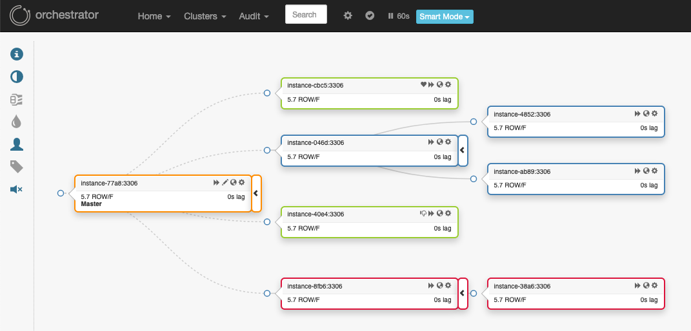

 

# orchestrator [[Documentation]](https://github.com/openark/orchestrator/tree/master/docs)

`orchestrator` is a MySQL and MariaDB high availability and replication management tool, runs as a service and provides command line access, HTTP API and Web interface. `orchestrator` supports:

#### Discovery

`orchestrator` actively crawls through your topologies and maps them. It reads basic MySQL info such as replication status and configuration.

It provides you with slick visualization of your topologies, including replication problems, even in the face of failures.

#### Refactoring

`orchestrator` understands replication rules. It knows about binlog file:position, GTID, Pseudo GTID, Binlog Servers.

Refactoring replication topologies can be a matter of drag & drop a replica under another master. Moving replicas around is safe: `orchestrator` will reject an illegal refactoring attempt.

Fine-grained control is achieved by various command line options.

#### Recovery

`orchestrator` uses a holistic approach to detect master and intermediate master failures. Based on information gained from the topology itself, it recognizes a variety of failure scenarios.

Configurable, it may choose to perform automated recovery (or allow the user to choose type of manual recovery). Intermediate master recovery achieved internally to `orchestrator`. Master failover supported by pre/post failure hooks.

Recovery process utilizes _orchestrator's_ understanding of the topology and of its ability to perform refactoring. It is based on _state_ as opposed to _configuration_: `orchestrator` picks the best recovery method by investigating/evaluating the topology at the time of
recovery itself.

#### The interface

`orchestrator` supports:

- Command line interface (love your debug messages, take control of automated scripting)
- Web API (HTTP GET access)
- Web interface, a _slick_ one.

#### Additional perks

- Highly available
- Controlled master takeovers
- Manual failovers
- Failover auditing
- Audited operations
- Pseudo-GTID
- Datacenter/physical location awareness
- MySQL-Pool association
- HTTP security/authentication methods
- There is also an [orchestrator-mysql](https://groups.google.com/forum/#!forum/orchestrator-mysql) Google groups forum to discuss topics related to orchestrator
- More...

Read the [Orchestrator documentation](https://github.com/openark/orchestrator/tree/master/docs)

Authored by [Shlomi Noach](https://github.com/shlomi-noach):

- 2020- as https://github.com/openark/orchestrator
- 2016-2020 at [GitHub](http://github.com) as https://github.com/github/orchestrator
- 2015 at [Booking.com](http://booking.com) as https://github.com/outbrain/orchestrator
- 2014 at [Outbrain](http://outbrain.com) as https://github.com/outbrain/orchestrator

#### Related projects

- Orchestrator Puppet module: https://github.com/github/puppet-orchestrator-for-mysql
- Orchestrator Chef Cookbook (1): https://github.com/silviabotros/chef-orchestrator
- Orchestrator Chef Cookbook (2): https://supermarket.chef.io/cookbooks/orchestrator
- Nagios / Icinga check based on Orchestrator API: https://github.com/mcrauwel/go-check-orchestrator
- Light Python wrapper for Orchestrator API: https://github.com/stirlab/python-mysql-orchestrator

#### Developers

Get started developing Orchestrator by [reading the developer docs](/docs/developers.md). Thanks for your interest!

#### License

`orchestrator` is free and open sourced under the [Apache 2.0 license](LICENSE).
