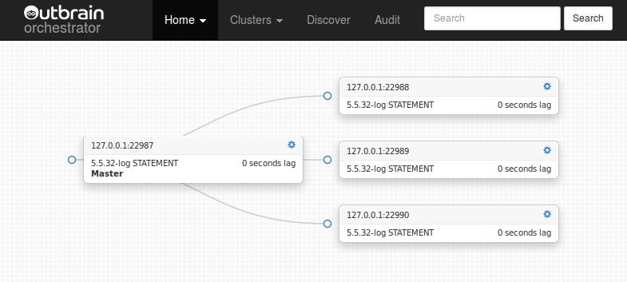
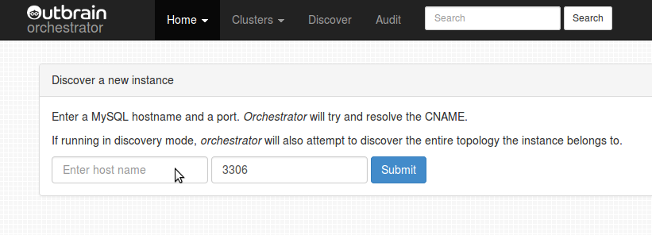
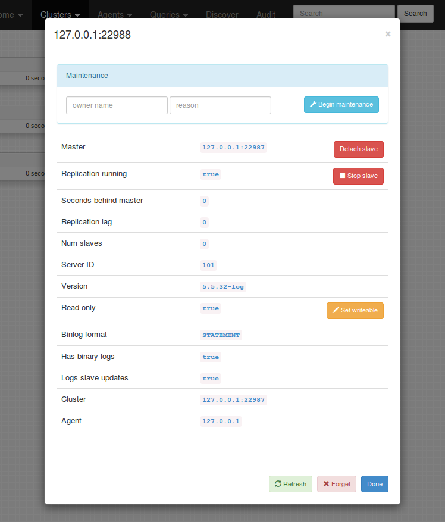
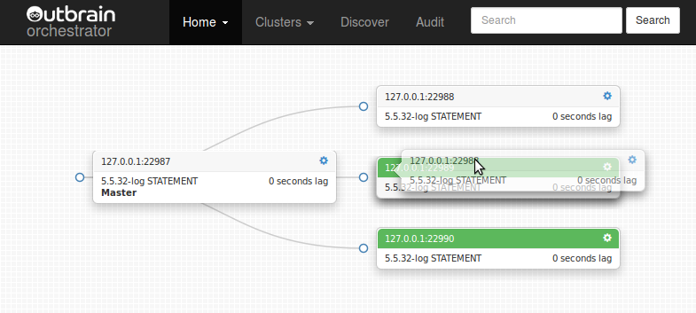
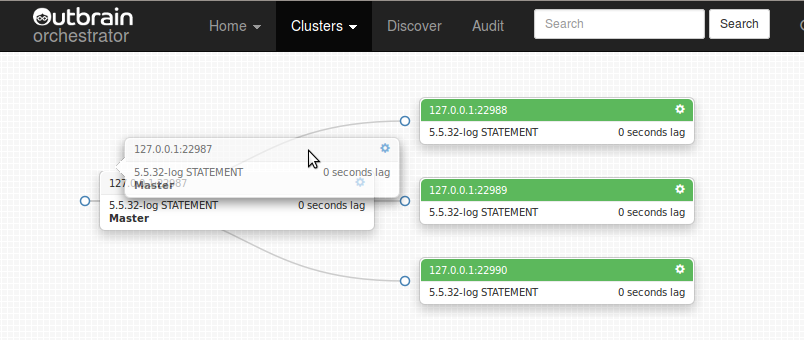
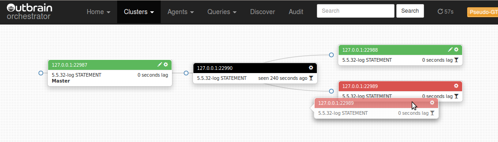
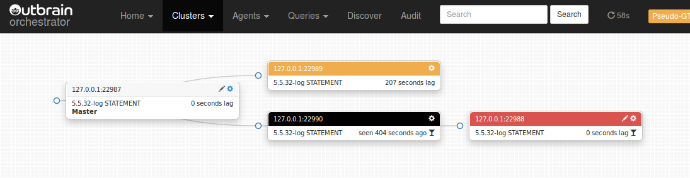

[Table of Contents](#toc)

## About

_Orchestrator_ is a MySQL replication topology management and visualization tool, allowing for:

#### Discovery

_orchestrator_ actively crawls through your topologies and maps them. It reads basic MySQL info such as replication status and configuration.

It provides with slick visualization of your topologies, including replication problems, even in the face of failures.

#### Refactoring

_orchestrator_ understands replication rules. It knows about binlog file:position, GTID, Pseudo GTID, Binlog Servers.

Refactoring replication topologies can be a matter of drag & drop a replica under another master. Moving slaves around becomes
safe: _orchestrator_ will reject an illegal refactoring attempt.

Find grained control is achieved by various command line options.

#### Recovery

_Orchestrator_ uses a holistic approach to detect master and intermediate master failures. Based on information gained from
the topology itself, it recognizes a variety of failure scenarios.

Configurable, it may choose to perform automated recovery (or allow the user to choose type of manual recovery). Intermediate master
recovery achieved internally to _orchestrator_. Master failover supported by pre/post failure hooks.

Recovery process utilizes _orchestrator's_ understanding of the topology and of its ability to perform refactoring. It is based on _state_ as opposed to _configuration_: _orchestrator_ picks the best recovery method by investigating/evaluating the topology at the time of
recovery itself.



#### Credits, attributions

Authored by [Shlomi Noach](https://github.com/shlomi-noach)

This project was originally initiated at [Outbrain](http://outbrain.com), who were kind enough to release it as open source in its very first days. Outbrain were also kind enough to permit the change of license from Apache 2.0 to MIT, the latter being even more permissible than the former.

The project was later developed at [Booking.com](http://booking.com) and the company was gracious enough to release further changes into the open source.

At this time the project is being developed at [GitHub](http://github.com).
We will continue to keep it open and supported.

The project accepts pull-requests and encourages them. Thank you for any improvement/assistance!

Additional collaborators & contributors to this Wiki:

- [grierj](https://github.com/grierj)
- Other awesome people

#### TOC

- [About](#about)
- [License](#license)
- [Download](#download)
- [Requirements](#requirements)
- [Installation](#installation)
- [Execution](#execution)
- [Executing via command line](#executing-via-command-line)
- [Using the Web interface](#using-the-web-interface)
- [Using the web API](#using-the-web-api)
- [Security](#security)
- [SSL and TLS](#ssl-and-tls)
- [Status Checks](#status-checks)
- [Configuration](#configuration)
- [Pseudo GTID](#pseudo-gtid)
- [Topology recovery](#topology-recovery)
- [Agents](#agents)
- [Risks](#risks)
- [Gotchas](#gotchas)
- [Supported topologies and versions](#supported-topologies-and-versions)
- [Bugs](#bugs)
- [Contributions](#contributions)


## License
_Orchestrator_ is released as open source under the [Apache 2.0 license](http://www.apache.org/licenses/LICENSE-2.0)


## Download
_Orchestrator_ is released as open source and is available at [GitHub](https://github.com/outbrain/orchestrator).
Find official releases in https://github.com/outbrain/orchestrator/releases

For developers: _Orchestrator_ is go-gettable. Issue:

	go get github.com/outbrain/orchestrator

Read more on [Orchestrator for developers](Orchestrator-for-developers)


## Requirements
_Orchestrator_ is a standalone Go application. It requires a MySQL backend to store topologies state, maintenance status and audit history.
It is built and tested on Linux 64bit, and binaries are availably for this OS type alone. The author has not tested any other operating system.
However the [build script](https://github.com/outbrain/orchestrator/blob/master/build.sh) is capable of building _orchestrator_ for other OS/architectures.


## Installation

For production deployments, see [Orchestrator deployment](Orchestrator-deployment). The following text walks you through the manual way of installation and the necessary configuration to make it work.

The following assumes you will be using the same machine for both the _orchestrator_ binary and the MySQL backend.
If not, replace `127.0.0.1` with appropriate host name. Replace `orch_backend_password` with your own super secret password.

#### Extract orchestrator binary and files

- Extract from tarball

  Extract the archive you've downloaded from https://github.com/outbrain/orchestrator/releases
  For example, let's assume you wish to install _orchestrator_ under `/usr/local/orchestrator`:

      sudo mkdir -p /usr/local
      sudo cd /usr/local
      sudo tar xzfv orchestrator-1.0.tar.gz

- Install from `RPM`

  Installs onto `/usr/local/orchestrator`. Execute:

      sudo rpm -i orchestrator-1.0-1.x86_64.rpm


- Install from `DEB`

  Installs onto `/usr/local/orchestrator`. Execute:

      sudo dpkg -i orchestrator_1.0_amd64.deb


#### Setup backend MySQL server

Setup a MySQL server for backend, and invoke the following:

    CREATE DATABASE IF NOT EXISTS orchestrator;
    GRANT ALL PRIVILEGES ON `orchestrator`.* TO 'orchestrator'@'127.0.0.1' IDENTIFIED BY 'orch_backend_password';

_Orchestrator_ uses a configuration file, located in either `/etc/orchestrator.conf.json` or relative path to binary `conf/orchestrator.conf.json` or
`orchestrator.conf.json`.
The installed package includes a file called `orchestrator.conf.json.sample` with some basic settings which you can use as baseline for `orchestrator.conf.json`.
Edit `orchestrator.conf.json` to match the above as follows:

    ...
    "MySQLOrchestratorHost": "127.0.0.1",
    "MySQLOrchestratorPort": 3306,
    "MySQLOrchestratorDatabase": "orchestrator",
    "MySQLOrchestratorUser": "orchestrator",
    "MySQLOrchestratorPassword": "orch_backend_password",
    ...


#### Grant access to orchestrator on all your MySQL servers
For _orchestrator_ to detect your replication topologies, it must also have an account on each and every topology. At this stage this has to be the
same account (same user, same password) for all topologies. On each of your masters, issue the following:

    GRANT SUPER, PROCESS, REPLICATION SLAVE, RELOAD ON *.* TO 'orchestrator'@'orch_host' IDENTIFIED BY 'orch_topology_password';
    GRANT SELECT ON mysql.slave_master_info TO 'orchestrator'@'orch_host';

> `REPLICATION SLAVE` is required for `SHOW SLAVE HOSTS`, and for scanning binary logs in favor of [Pseudo GTID](#pseudo-gtid)
> `RELOAD` required for `RESET SLAVE` operation
> `PROCESS` required to see slave processes in `SHOW PROCESSLIST`
> On MySQL 5.6 and above, and if using `master_info_repository = 'TABLE'`, let orchestrator have access
> to the `mysql.slave_master_info` table. This will allow orchestrator to grab replication credentials if need be.

Replace `orch_host` with hostname or orchestrator machine (or do your wildcards thing). Choose your password wisely. Edit `orchestrator.conf.json` to match:

    "MySQLTopologyUser": "orchestrator",
    "MySQLTopologyPassword": "orch_topology_password",


Consider moving `conf/orchestrator.conf.json` to `/etc/orchestrator.conf.json` (both locations are valid)

To execute _orchestrator_ in command line mode or in HTTP API only, all you need is the `orchestrator` binary.
To enjoy the rich web interface, including topology visualizations and drag-and-drop topology changes, you will need
the `resources` directory and all that is underneath it. If you're unsure, don't touch; things are already in place.


## Execution


#### Executing as web/API service

Assuming you've installed _orchestrator_ under `/usr/local/orchestrator`:

    cd /usr/local/orchestrator && ./orchestrator http

_Orchestrator_ will start listening on port `3000`. Point your browser to `http://your.host:3000/`
and you're ready to go. You may skip to next sections.

If you like your debug messages, issue:

    cd /usr/local/orchestrator && ./orchestrator --debug http

or, even more detailed in case of error:

    cd /usr/local/orchestrator && ./orchestrator --debug --stack http

The above looks for configuration in `/etc/orchestrator.conf.json`, `conf/orchestrator.conf.json`, `orchestrator.conf.json`, in that order.
Classic is to put configuration in `/etc/orchestrator.conf.json`. Since it contains credentials to your MySQL servers you may wish to limit access to that file.
You may choose to use a different location for the configuration file, in which case execute:

    cd /usr/local/orchestrator && ./orchestrator --debug --config=/path/to/config.file http

Web/API service will, by default, issue a continuous, infinite polling of all known servers. This keeps _orchestrator_'s data up to date.
You typically want this behavior, but you may disable it, making _orchestrator_ just serve API/Web but never update the instances status:

    cd /usr/local/orchestrator && ./orchestrator --discovery=false http

The above is useful for development and testing purposes. You probably wish to keep to the defaults.


#### Executing via command line

Also consult the [Orchestrator first steps](Orchestrator-first-steps) page.

Following is a synopsis of command line samples. For simplicity, we assume `orchestrator` is in your path.
If not, replace `orchestrator` with `/path/to/orchestrator`.

> Samples below use a test `mysqlsandbox` topology, where all instances are on same host `127.0.0.1` and on different ports. `22987` is master,
> and `22988`, `22989`, `22990` are slaves.

Show currently known clusters (replication topologies):

    orchestrator -c clusters cli

> The above looks for configuration in `/etc/orchestrator.conf.json`, `conf/orchestrator.conf.json`, `orchestrator.conf.json`, in that order.
> Classic is to put configuration in `/etc/orchestrator.conf.json`. Since it contains credentials to your MySQL servers you may wish to limit access to that file.

You may choose to use a different location for the configuration file, in which case execute:

    orchestrator -c clusters --config=/path/to/config.file cli

> `-c` stands for `command`, and is mandatory.

Discover a new instance ("teach" _orchestrator_ about your topology). _Orchestrator_ will automatically recursively drill up the master chain (if any)
and down the slaves chain (if any) to detect the entire topology:

    orchestrator -c discover -i 127.0.0.1:22987 cli

> `-i` stands for `instance` and must be in the form `hostname:port`.

Do the same, and be more verbose:

    orchestrator -c discover -i 127.0.0.1:22987 --debug cli
    orchestrator -c discover -i 127.0.0.1:22987 --debug --stack cli

> `--debug` can be useful in all operations. `--stack` prints code stack trace on (most) errors and is useful
> for development & testing purposed or for submitting bug reports.

Forget an instance (an instance may be manually or automatically re-discovered via `discover` command above):

    orchestrator -c forget -i 127.0.0.1:22987 cli

Print an ASCII tree of topology instances. Pass a cluster name via `-i` (see `clusters` command above):

    orchestrator -c topology -i 127.0.0.1:22987 cli

> Sample output:
>
>     127.0.0.1:22987
>     + 127.0.0.1:22989
>       + 127.0.0.1:22988
>     + 127.0.0.1:22990

Move the slave around the topology:

    orchestrator -c relocate -i 127.0.0.1:22988 -d 127.0.0.1:22987

> Resulting topology:
>
>     127.0.0.1:22987
>     + 127.0.0.1:22989
>     + 127.0.0.1:22988
>     + 127.0.0.1:22990

The above happens to move the slave one level up. However the `relocate` command accepts any valid destination. `relocate`
figures out the best way to move a slave. If GTID is enabled, use it. If Pseudo-GTID is available, use it. If a binlog server is
involved, use it. I _orchestrator_ has further insight into the specific coordinates involved, use it. Otherwise just use
plain-old binlog log file:pos math.

Similar to `relocate`, you can move multiple slaves via `relocate-slaves`. This moves slaves-of-an-instance below another server.

> Assume this:
>
>     10.0.0.1:3306
>     + 10.0.0.2:3306
>       + 10.0.0.3:3306
>       + 10.0.0.4:3306
>       + 10.0.0.5:3306
>     + 10.0.0.6:3306

    orchestrator -c relocate-slaves -i 10.0.0.2:3306 -d 10.0.0.6

> Results with:
>
>     10.0.0.1:3306
>     + 10.0.0.2:3306
>     + 10.0.0.6:3306
>       + 10.0.0.3:3306
>       + 10.0.0.4:3306
>       + 10.0.0.5:3306

> You may use `--pattern` to filter those slaves affected.

Other command sgive you a more fine grained control on how your servers are relocated. Consider the _classic_ binary log file:pos
way of repointing slaves:

Move a slave up the topology (make it sbling of its master, or direct slave of its "grandparent"):

    orchestrator -c move-up -i 127.0.0.1:22988 cli

> The above command will only succeed if the instance _has_ a grandparent, and does not have _problems_ such as slave lag etc.

Move a slave below its sibling:

    orchestrator -c move-below -i 127.0.0.1:22988 -d 127.0.0.1:22990 --debug cli

> `-s` stands for `sibling`.

> The above command will only succeed if `127.0.0.1:22988` and `127.0.0.1:22990` are siblings (slaves of same master), none of them has _problems_ (e.g. slave lag),
> and the sibling _can_ be master of instance (i.e. has binary logs, has `log_slave_updates`, no version collision etc.)

Promote a slave to be co-master with its master, making for a circular Master-Master topology:

    orchestrator -c make-co-master -i 127.0.0.1:22988 cli

> The above command will only succeed if `127.0.0.1:22988`'s master is root of topology (is not itself a slave)
> and is not associated in another co-master ring.

Reset a slave, effectively breaking down the replication (destructive action):

    orchestrator -c reset-slave -i 127.0.0.1:22988 cli

> *A note on topology refactoring commands*
>
> `move-up`, `move-below`, `make-co-master` and `reset-slave` are the building blocks of _classic_ topology refactoring.
> With the first two actions one can make any change to the topology, with the exception of moving the master.
> The last two allow replacing a master by promoting one of its slaves to be a co-master (MySQL master-master
> replication), then resetting the newly promoted co-master, effectively making it the master of all topology.

> These actions are also as atomic as possible, by only affecting two replication servers per action (e.g. `move-up` affects
> the instance and its master; `move-below` affect the instance and its sibling).

> The word _classic_ relates to the method of using an up-and-alive topology, where all connections are good and
> instances can be queried for their replication status.

> However _orchestrator_ also supports topology refactoring in situations where servers are inaccessible.
> This could made to work via GTID and Pseudo-GTID.
>
> It may allow promoting a slave up the topology even as its master is dead, or
> matching and synching the slaves of a failed master even though they all stopped replicating in different
> positions.

The following are Pseudo-GTID specific commands:

Match a slave below another instance (we expect the other instance to be as advanced or more advanced than the moved slave)

    orchestrator -c match-below -i 127.0.0.1:22988 -d 127.0.0.1:22990 --debug cli

> The above required Pseudo GTID to be present and configured. It may take more time to execute as it needs to
> look up entires in the servers binary log.
> See [Pseudo GTID](#pseudo-gtid) for more details.

Make an instance read-only or writeable:

    orchestrator -c set-read-only -i 127.0.0.1:22988 cli
    orchestrator -c set-writeable -i 127.0.0.1:22988 cli

Begin maintenance mode on an instance. While in maintenance mode, _orchestrator_ will not allow this instance to
be moved or participate in another instance's move:

    orchestrator -c begin-maintenance -i 127.0.0.1:22988 --reason="load testing; do not disturb" cli

End maintenance mode on an instance:

    orchestrator -c end-maintenance -i 127.0.0.1:22988 cli

Make an infinite, continuous discovery and investigation of known instances. Typically this is what the web service executes.

    orchestrator -c continuous --debug cli

Just check if an instance can be connected: attempt to resolve hostname and make a TCP connection to host & port:

    orchestrator -c resolve -i myhost.mydomain:3306

##### Complete orchestrator CLI documentation

```
orchestrator [-c command] [-i instance] [-d destination] [--verbose|--debug] [... cli ] | http

Cheatsheet:
    Run orchestrator in HTTP mode:

        orchestrator --debug http

    See all possible commands:

        orchestrator -c help

    Usage for most commands:
        orchestrator -c <command> [-i <instance.fqdn>] [-d <destination.fqdn>] [--verbose|--debug]

    -i (instance):
        instance on which to operate, in "hostname" or "hostname:port" format.
        Default port is 3306 (or DefaultInstancePort in config)
        For some commands this argument can be ommitted altogether, and the
        value is implicitly the local hostname.
    -d (Destination)
        destination instance (used when moving replicas around or when failing over)
    -s (Sibling/Subinstance/deStination) - synonym to "-d"

    -c (command):
        Listed below are all available commands; all of which apply for CLI execution (ignored by HTTP mode).
        Different flags are required for different commands; see specific documentation per commmand.

    Topology refactoring, generic aka "smart" commands
        These operations let orchestrator pick the best course of action for relocating slaves. It may choose to use
        standard binlog file:pos math, GTID, Pseudo-GTID, or take advantage of binlog servers, or combine two or more
        methods in a multi-step operation.
        In case a of a multi-step operation, failure may result in slaves only moving halfway to destination point. Nonetheless
        they will be in a valid position.

        relocate
            Relocate a slave beneath another (destination) instance. The choice of destination is almost arbitrary;
            it must not be a child/descendant of the instance, but otherwise it can be anywhere, and can be a normal slave
            or a binlog server. Orchestrator will choose the best course of action to relocate the slave.
            No action taken when destination instance cannot act as master (e.g. has no binary logs, is of incompatible version, incompatible binlog format etc.)
            Examples:

            orchestrator -c relocate -i slave.to.relocate.com -d instance.that.becomes.its.master

            orchestrator -c relocate -d destination.instance.that.becomes.its.master
                -i not given, implicitly assumed local hostname

            (this command was previously named "relocate-below")

        relocate-slaves
            Relocates all or part of the slaves of a given instance under another (destination) instance. This is
            typically much faster than relocating slaves one by one.
            Orchestrator chooses the best course of action to relocation the slaves. It may choose a multi-step operations.
            Some slaves may succeed and some may fail the operation.
            The instance (slaves' master) itself may be crashed or inaccessible. It is not contacted throughout the operation.
            Examples:

            orchestrator -c relocate-slaves -i instance.whose.slaves.will.relocate -d instance.that.becomes.their.master

            orchestrator -c relocate-slaves -i instance.whose.slaves.will.relocate -d instance.that.becomes.their.master --pattern=regexp.filter
                only apply to those instances that match given regex

    Topology refactoring using classic MySQL replication commands
        (ie STOP SLAVE; START SLAVE UNTIL; CHANGE MASTER TO; ...)
        These commands require connected topology: slaves that are up and running; a lagging, stopped or
        failed slave will disable use of most these commands. At least one, and typically two or more slaves
        will be stopped for a short time during these operations.

        move-up
            Move a slave one level up the topology; makes it replicate from its grandparent and become sibling of
            its parent. It is OK if the instance's master is not replicating. Examples:

            orchestrator -c move-up -i slave.to.move.up.com:3306

            orchestrator -c move-up
                -i not given, implicitly assumed local hostname

        move-up-slaves
            Moves slaves of the given instance one level up the topology, making them siblings of given instance.
            This is a (faster) shortcut to executing move-up on all slaves of given instance.
            Examples:

            orchestrator -c move-up-slaves -i slave.whose.subslaves.will.move.up.com[:3306]

            orchestrator -c move-up-slaves -i slave.whose.subslaves.will.move.up.com[:3306] --pattern=regexp.filter
                only apply to those instances that match given regex

        move-below
            Moves a slave beneath its sibling. Both slaves must be actively replicating from same master.
            The sibling will become instance's master. No action taken when sibling cannot act as master
            (e.g. has no binary logs, is of incompatible version, incompatible binlog format etc.)
            Example:

            orchestrator -c move-below -i slave.to.move.com -d sibling.slave.under.which.to.move.com

            orchestrator -c move-below -d sibling.slave.under.which.to.move.com
                -i not given, implicitly assumed local hostname

        move-equivalent
            Moves a slave beneath another server, based on previously recorded "equivalence coordinates". Such coordinates
            are obtained whenever orchestrator issues a CHANGE MASTER TO. The "before" and "after" masters coordinates are
            persisted. In such cases where the newly relocated slave is unable to replicate (e.g. firewall issues) it is then
            easy to revert the relocation via "move-equivalent".
            The command works if and only if orchestrator has an exact mapping between the slave's current replication coordinates
            and some other coordinates.
            Example:

            orchestrator -c move-equivalent -i slave.to.revert.master.position.com -d master.to.move.to.com              

        enslave-siblings
            Turn all siblings of a slave into its sub-slaves. No action taken for siblings that cannot become
            slaves of given instance (e.g. incompatible versions, binlog format etc.). This is a (faster) shortcut
            to executing move-below for all siblings of the given instance. Example:

            orchestrator -c enslave-siblings -i slave.whose.siblings.will.move.below.com

        enslave-master
            Turn an instance into a master of its own master; essentially switch the two. Slaves of each of the two
            involved instances are unaffected, and continue to replicate as they were.
            The instance's master must itself be a slave. It does not necessarily have to be actively replicating.

            orchestrator -c enslave-master -i slave.that.will.switch.places.with.its.master.com

        repoint
            Make the given instance replicate from another instance without changing the binglog coordinates. There
            are little sanity checks to this and this is a risky operation. Use cases are: a rename of the master's
            host, a corruption in relay-logs, move from beneath MaxScale & Binlog-server. Examples:

            orchestrator -c repoint -i slave.to.operate.on.com -d new.master.com

            orchestrator -c repoint -i slave.to.operate.on.com
                The above will repoint the slave back to its existing master without change

            orchestrator -c repoint
                -i not given, implicitly assumed local hostname

        repoint-slaves
            Repoint all slaves of given instance to replicate back from the instance. This is a convenience method
            which implies a one-by-one "repoint" command on each slave.

            orchestrator -c repoint-slaves -i instance.whose.slaves.will.be.repointed.com

            orchestrator -c repoint-slaves
                -i not given, implicitly assumed local hostname

        make-co-master
            Create a master-master replication. Given instance is a slave which replicates directly from a master.
            The master is then turned to be a slave of the instance. The master is expected to not be a slave.
            The read_only property of the slve is unaffected by this operation. Examples:

            orchestrator -c make-co-master -i slave.to.turn.into.co.master.com

            orchestrator -c make-co-master
                -i not given, implicitly assumed local hostname

        get-candidate-slave
            Information command suggesting the most up-to-date slave of a given instance, which can be promoted
            as local master to its siblings. If replication is up and running, this command merely gives an
            estimate, since slaves advance and progress continuously in different pace. If all slaves of given
            instance have broken replication (e.g. because given instance is dead), then this command provides
            with a definitve candidate, which could act as a replace master. See also regroup-slaves. Example:

            orchestrator -c get-candidate-slave -i instance.with.slaves.one.of.which.may.be.candidate.com

        regroup-slaves-bls
            Given an instance that has Binlog Servers for slaves, promote one such Binlog Server over its other
            Binlog Server siblings.

            Example:

            orchestrator -c regroup-slaves-bls -i instance.with.binlog.server.slaves.com

            --debug is your friend.


    Topology refactoring using GTID
        These operations only work if GTID (either Oracle or MariaDB variants) is enabled on your servers.

        move-gtid
            Move a slave beneath another (destination) instance. Orchestrator will reject the operation if GTID is
            not enabled on the slave, or is not supported by the would-be master.
            You may try and move the slave under any other instance; there are no constraints on the family ties the
            two may have, though you should be careful as not to try and replicate from a descendant (making an
            impossible loop).
            Examples:

            orchestrator -c move-gtid -i slave.to.move.com -d instance.that.becomes.its.master

            orchestrator -c match -d destination.instance.that.becomes.its.master
                -i not given, implicitly assumed local hostname

        move-slaves-gtid
            Moves all slaves of a given instance under another (destination) instance using GTID. This is a (faster)
            shortcut to moving each slave via "move-gtid".
            Orchestrator will only move those slaves configured with GTID (either Oracle or MariaDB variants) and under the
            condition the would-be master supports GTID.
            Examples:

            orchestrator -c move-slaves-gtid -i instance.whose.slaves.will.relocate -d instance.that.becomes.their.master

            orchestrator -c move-slaves-gtid -i instance.whose.slaves.will.relocate -d instance.that.becomes.their.master --pattern=regexp.filter
                only apply to those instances that match given regex

        regroup-slaves-gtid
            Given an instance (possibly a crashed one; it is never being accessed), pick one of its slave and make it
            local master of its siblings, using GTID. The rules are similar to those in the "regroup-slaves" command.
            Example:

            orchestrator -c regroup-slaves-gtid -i instance.with.gtid.and.slaves.one.of.which.will.turn.local.master.if.possible

            --debug is your friend.


    Topology refactoring using Pseudo-GTID
        These operations require that the topology's master is periodically injected with pseudo-GTID,
        and that the PseudoGTIDPattern configuration is setup accordingly. Also consider setting
        DetectPseudoGTIDQuery.
        Operations via Pseudo-GTID are typically slower, since they involve scanning of binary/relay logs.
        They impose less constraints on topology locations and affect less servers. Only servers that
        are being relocateed have their replication stopped. Their masters or destinations are unaffected.

        match
            Matches a slave beneath another (destination) instance. The choice of destination is almost arbitrary;
            it must not be a child/descendant of the instance. But otherwise they don't have to be direct siblings,
            and in fact (if you know what you're doing), they don't actually have to belong to the same topology.
            The operation expects the relocated instance to be "behind" the destination instance. It only finds out
            whether this is the case by the end; the operation is cancelled in the event this is not the case.
            No action taken when destination instance cannot act as master (e.g. has no binary logs, is of incompatible version, incompatible binlog format etc.)
            Examples:

            orchestrator -c match -i slave.to.relocate.com -d instance.that.becomes.its.master

            orchestrator -c match -d destination.instance.that.becomes.its.master
                -i not given, implicitly assumed local hostname

            (this command was previously named "match-below")

        match-slaves
            Matches all slaves of a given instance under another (destination) instance. This is a (faster) shortcut
            to matching said slaves one by one under the destination instance. In fact, this bulk operation is highly
            optimized and can execute in orders of magnitue faster, depeding on the nu,ber of slaves involved and their
            respective position behind the instance (the more slaves, the more savings).
            The instance itself may be crashed or inaccessible. It is not contacted throughout the operation. Examples:

            orchestrator -c match-slaves -i instance.whose.slaves.will.relocate -d instance.that.becomes.their.master

            orchestrator -c match-slaves -i instance.whose.slaves.will.relocate -d instance.that.becomes.their.master --pattern=regexp.filter
                only apply to those instances that match given regex

            (this command was previously named "multi-match-slaves")

        match-up
            Transport the slave one level up the hierarchy, making it child of its grandparent. This is
            similar in essence to move-up, only based on Pseudo-GTID. The master of the given instance
            does not need to be alive or connected (and could in fact be crashed). It is never contacted.
            Grandparent instance must be alive and accessible.
            Examples:

            orchestrator -c match-up -i slave.to.match.up.com:3306

            orchestrator -c match-up
                -i not given, implicitly assumed local hostname

        match-up-slaves
            Matches slaves of the given instance one level up the topology, making them siblings of given instance.
            This is a (faster) shortcut to executing match-up on all slaves of given instance. The instance need
            not be alive / accessib;e / functional. It can be crashed.
            Example:

            orchestrator -c match-up-slaves -i slave.whose.subslaves.will.match.up.com

            orchestrator -c match-up-slaves -i slave.whose.subslaves.will.match.up.com[:3306] --pattern=regexp.filter
                only apply to those instances that match given regex

        rematch
            Reconnect a slave onto its master, via PSeudo-GTID. The use case for this operation is a non-crash-safe
            replication configuration (e.g. MySQL 5.5) with sync_binlog=1 and log_slave_updates. This operation
            implies crash-safe-replication and makes it possible for the slave to reconnect. Example:

            orchestrator -c rematch -i slave.to.rematch.under.its.master

        regroup-slaves
            Given an instance (possibly a crashed one; it is never being accessed), pick one of its slave and make it
            local master of its siblings, using Pseudo-GTID. It is uncertain that there *is* a slave that will be able to
            become master to all its siblings. But if there is one, orchestrator will pick such one. There are many
            constraints, most notably the replication positions of all slaves, whether they use log_slave_updates, and
            otherwise version compatabilities etc.
            As many slaves that can be regrouped under promoted slves are operated on. The rest are untouched.
            This command is useful in the event of a crash. For example, in the event that a master dies, this operation
            can promote a candidate replacement and set up the remaining topology to correctly replicate from that
            replacement slave. Example:

            orchestrator -c regroup-slaves -i instance.with.slaves.one.of.which.will.turn.local.master.if.possible

            --debug is your friend.

    General replication commands
        These commands issue various statements that relate to replication.

        enable-gtid
            If possible, enable GTID replication. This works on Oracle (>= 5.6, gtid-mode=1) and MariaDB (>= 10.0).
            Replication is stopped for a short duration so as to reconfigure as GTID. In case of error replication remains
            stopped. Example:

            orchestrator -c enable-gtid -i slave.compatible.with.gtid.com

        disable-gtid
            Assuming slave replicates via GTID, disable GTID replication and resume standard file:pos replication. Example:

            orchestrator -c disable-gtid -i slave.replicating.via.gtid.com

        stop-slave
            Issues a STOP SLAVE; command. Example:

            orchestrator -c stop-slave -i slave.to.be.stopped.com

        start-slave
            Issues a START SLAVE; command. Example:

            orchestrator -c start-slave -i slave.to.be.started.com

        restart-slave
            Issues STOP SLAVE + START SLAVE; Example:

            orchestrator -c restart-slave -i slave.to.be.started.com

        skip-query
            On a failed replicating slave, skips a single query and attempts to resume replication.
            Only applies when the replication seems to be broken on SQL thread (e.g. on duplicate
            key error). Also works in GTID mode. Example:

            orchestrator -c skip-query -i slave.with.broken.sql.thread.com

        reset-slave
            Issues a RESET SLAVE command. Destructive to replication. Example:

            orchestrator -c reset-slave -i slave.to.reset.com

        detach-slave
            Stops replication and modified binlog position into an impossible, yet reversible, value.
            This effectively means the replication becomes broken. See reattach-slave. Example:

            orchestrator -c detach-slave -i slave.whose.replication.will.break.com

            Issuing this on an already detached slave will do nothing.

        reattach-slave
            Undo a detach-slave operation. Reverses the binlog change into the original values, and
            resumes replication. Example:

            orchestrator -c reattach-slave -i detahced.slave.whose.replication.will.amend.com

            Issuing this on an attached (i.e. normal) slave will do nothing.

    General instance commands
        Applying general instance configuration and state

        set-read-only
            Turn an instance read-only, via SET GLOBAL read_only := 1. Examples:

            orchestrator -c set-read-only -i instance.to.turn.read.only.com

            orchestrator -c set-read-only
                -i not given, implicitly assumed local hostname

        set-writeable
            Turn an instance writeable, via SET GLOBAL read_only := 0. Example:

            orchestrator -c set-writeable -i instance.to.turn.writeable.com

            orchestrator -c set-writeable
                -i not given, implicitly assumed local hostname

    Binlog commands
        Commands that investigate/work on binary logs

        flush-binary-logs
            Flush binary logs on an instance. Examples:

            orchestrator -c flush-binary-logs -i instance.with.binary.logs.com

            orchestrator -c flush-binary-logs -i instance.with.binary.logs.com --binlog=mysql-bin.002048
                Flushes binary logs until reaching given number. Fails when current number is larger than input

        purge-binary-logs
            Purge binary logs on an instance. Examples:

            orchestrator -c purge-binary-logs -i instance.with.binary.logs.com --binlog mysql-bin.002048

                Purges binary logs until given log

        last-pseudo-gtid
            Information command; an authoritative way of detecting whether a Pseudo-GTID event exist for an instance,
            and if so, output the last Pseudo-GTID entry and its location. Example:

            orchestrator -c last-pseudo-gtid -i instance.with.possible.pseudo-gtid.injection

        find-binlog-entry
            Get binlog file:pos of entry given by --pattern (exact full match, not a regular expression) in a given instance.
            This will search the instance's binary logs starting with most recent, and terminate as soon as an exact match is found.
            The given input is not a regular expression. It must fully match the entry (not a substring).
            This is most useful when looking for uniquely identifyable values, such as Pseudo-GTID. Example:

            orchestrator -c find-binlog-entry -i instance.to.search.on.com --pattern "insert into my_data (my_column) values ('distinct_value_01234_56789')"

                Prints out the binlog file:pos where the entry is found, or errors if unfound.

        correlate-binlog-pos
            Given an instance (-i) and binlog coordinates (--binlog=file:pos), find the correlated coordinates in another instance (-d).
            "Correlated coordinates" are those that present the same point-in-time of sequence of binary log events, untangling
            the mess of different binlog file:pos coordinates on different servers.
            This operation relies on Pseudo-GTID: your servers must have been pre-injected with PSeudo-GTID entries as these are
            being used as binlog markers in the correlation process.
            You must provide a valid file:pos in the binlogs of the source instance (-i), and in response get the correlated
            coordinates in the binlogs of the destination instance (-d). This operation does not work on relay logs.
            Example:

            -c correlate-binlog-pos  -i instance.with.binary.log.com --binlog=mysql-bin.002366:14127 -d other.instance.with.binary.logs.com

                Prints out correlated coordinates, e.g.: "mysql-bin.002302:14220", or errors out.

    Pool commands
        Orchestrator provides with getter/setter commands for handling pools. It does not on its own investigate pools,
        but merely accepts and provides association of an instance (host:port) and a pool (any_name).

        submit-pool-instances
            Submit a pool name with a list of instances in that pool. This removes any previous instances associated with
            that pool. Expecting comma delimited list of instances

            orchestrator -c submit-pool-instances --pool name_of_pool -i pooled.instance1.com,pooled.instance2.com:3306,pooled.instance3.com

        cluster-pool-instances
            List all pools and their associated instances. Output is in tab delimited format, and lists:
            cluster_name, cluster_alias, pool_name, pooled instance
            Example:

            orchestrator -c cluster-pool-instances

    Information commands
        These commands provide/store information about topologies, replication connections, or otherwise orchstrator's
        "inventory".

        find
            Find instances whose hostname matches given regex pattern. Example:

            orchestrator -c find -pattern "backup.*us-east"

        clusters
            List all clusters known to orchestrator. A cluster (aka topology, aka chain) is identified by its
            master (or one of its master if more than one exists). Example:

            orchesrtator -c clusters
                -i not given, implicitly assumed local hostname

        topology
            Show an ascii-graph of a replication topology, given a member of that topology. Example:

            orchestrator -c topology -i instance.belonging.to.a.topology.com

            orchestrator -c topology
                -i not given, implicitly assumed local hostname

            Instance must be already known to orchestrator. Topology is generated by orchestrator's mapping
            and not from synchronuous investigation of the instances. The generated topology may include
            instances that are dead, or whose replication is broken.

        which-instance
            Output the fully-qualified hostname:port representation of the given instance, or error if unknown
            to orchestrator. Examples:

            orchestrator -c which-instance -i instance.to.check.com

            orchestrator -c which-instance
                -i not given, implicitly assumed local hostname

        which-cluster
            Output the name of the cluster an instance belongs to, or error if unknown to orchestrator. Examples:

            orchestrator -c which-cluster -i instance.to.check.com

            orchestrator -c which-cluster
                -i not given, implicitly assumed local hostname

        which-cluster-instances
            Output the list of instances participating in same cluster as given instance; output is one line
            per instance, in hostname:port format. Examples:

            orchestrator -c which-cluster-instances -i instance.to.check.com

            orchestrator -c which-cluster-instances
                -i not given, implicitly assumed local hostname

            orchestrator -c which-cluster-instances -alias some_alias
                assuming some_alias is a known cluster alias (see ClusterNameToAlias or DetectClusterAliasQuery configuration)

        which-cluster-osc-slaves
            Output a list of slaves in same cluster as given instance, that would server as good candidates as control slaves
            for a pt-online-schema-change operation.
            Those slaves would be used for replication delay so as to throtthe osc operation. Selected slaves will include,
            where possible: intermediate masters, their slaves, 3rd level slaves, direct non-intermediate-master slaves.

            orchestrator -c which-cluster-osc-slaves -i instance.to.check.com

            orchestrator -c which-cluster-osc-slaves
                -i not given, implicitly assumed local hostname

            orchestrator -c which-cluster-osc-slaves -alias some_alias
                assuming some_alias is a known cluster alias (see ClusterNameToAlias or DetectClusterAliasQuery configuration)

        which-master
            Output the fully-qualified hostname:port representation of a given instance's master. Examples:

            orchestrator -c which-master -i a.known.slave.com

            orchestrator -c which-master
                -i not given, implicitly assumed local hostname

        which-slaves
            Output the fully-qualified hostname:port list of slaves (one per line) of a given instance (or empty
            list if instance is not a master to anyone). Examples:

            orchestrator -c which-slaves -i a.known.instance.com

            orchestrator -c which-slaves
                -i not given, implicitly assumed local hostname

        get-cluster-heuristic-lag
            For a given cluster (indicated by an instance or alias), output a heuristic "representative" lag of that cluster.
            The output is obtained by examining the slaves that are member of "which-cluster-osc-slaves"-command, and
            getting the maximum slave lag of those slaves. Recall that those slaves are a subset of the entire cluster,
            and that they are ebing polled periodically. Hence the output of this command is not necessarily up-to-date
            and does not represent all slaves in cluster. Examples:

            orchestrator -c get-cluster-heuristic-lag -i instance.that.is.part.of.cluster.com

            orchestrator -c get-cluster-heuristic-lag
                -i not given, implicitly assumed local host, cluster implied

            orchestrator -c get-cluster-heuristic-lag -alias some_alias
                assuming some_alias is a known cluster alias (see ClusterNameToAlias or DetectClusterAliasQuery configuration)

        instance-status
            Output short status on a given instance (name, replication status, noteable configuration). Example2:

            orchestrator -c instance-status -i instance.to.investigate.com

            orchestrator -c instance-status
                -i not given, implicitly assumed local hostname

        snapshot-topologies
            Take a snapshot of existing topologies. This will record minimal replication topology data: the identity
            of an instance, its master and its cluster.
            Taking a snapshot later allows for reviewing changes in topologies. One might wish to invoke this command
            on a daily basis, and later be able to solve questions like 'where was this instacne replicating from before
            we moved it?', 'which instances were replication from this instance a week ago?' etc. Example:

            orchestrator -c snapshot-topologies

    Orchestrator instance management
        These command dig into the way orchestrator manages instances and operations on instances           

        discover
            Request that orchestrator cotacts given instance, reads its status, and upsert it into
            orchestrator's respository. Examples:

            orchestrator -c discover -i instance.to.discover.com:3306

            orchestrator -c discover -i cname.of.instance

            orchestrator -c discover
                -i not given, implicitly assumed local hostname

            Orchestrator will resolve CNAMEs and VIPs.

        forget
            Request that orchestrator removed given instance from its repository. If the instance is alive
            and connected through replication to otherwise known and live instances, orchestrator will
            re-discover it by nature of its discovery process. Instances are auto-removed via config's
            UnseenAgentForgetHours. If you happen to know a machine is decommisioned, for example, it
            can be nice to remove it from the repository before it auto-expires. Example:  

            orchestrator -c forget -i instance.to.forget.com

            Orchestrator will *not* resolve CNAMEs and VIPs for given instance.

        begin-maintenance
            Request a maintenance lock on an instance. Topology changes require placing locks on the minimal set of
            affected instances, so as to avoid an incident of two uncoordinated operations on a smae instance (leading
            to possible chaos). Locks are placed in the backend database, and so multiple orchestrator instances are safe.
            Operations automatically acquire locks and release them. This command manually acquires a lock, and will
            block other operations on the instance until lock is released.
            Note that orchestrator automatically assumes locks to be expired after MaintenanceExpireMinutes (in config).
            Examples:

            orchestrator -c begin-maintenance -i instance.to.lock.com --duration=3h --reason="load testing; do not disturb"
                accepted duration format: 10s, 30m, 24h, 3d, 4w

            orchestrator -c begin-maintenance -i instance.to.lock.com --reason="load testing; do not disturb"
                --duration not given; default to config's MaintenanceExpireMinutes

        end-maintenance
            Remove maintenance lock; such lock may have been gained by an explicit begin-maintenance command implicitly
            by a topology change. You should generally only remove locks you have placed manually; orchestrator will
            automatically expire locks after MaintenanceExpireMinutes (in config).
            Example:

            orchestrator -c end-maintenance -i locked.instance.com

        begin-downtime
            Mark an instance as downtimed. A downtimed instance is assumed to be taken care of, and recovery-analysis does
            not apply for such an instance. As result, no recommendation for recovery, and no automated-recovery are issued
            on a downtimed instance.
            Downtime is different than maintanence in that it places no lock (mainenance uses an exclusive lock on the instance).
            It is OK to downtime an instance that is already downtimed -- the new begin-downtime command will override whatever
            previous downtime attributes there were on downtimes instance.  
            Note that orchestrator automatically assumes downtime to be expired after MaintenanceExpireMinutes (in config).
            Examples:

            orchestrator -c begin-downtime -i instance.to.downtime.com --duration=3h --reason="dba handling; do not do recovery"
                accepted duration format: 10s, 30m, 24h, 3d, 4w

            orchestrator -c begin-downtime -i instance.to.lock.com --reason="dba handling; do not do recovery"
                --duration not given; default to config's MaintenanceExpireMinutes

        end-downtime
            Indicate an instance is no longer downtimed. Typically you should not need to use this since
            a downtime is always bounded by a duration and auto-expires. But you may use this to forcibly
            indicate the active downtime should be expired now.
            Example:

            orchestrator -c end-downtime -i downtimed.instance.com

    Crash recovery commands

        recover
            Do auto-recovery given a dead instance. Orchestrator chooses the best course of action.
            The given instance must be acknowledged as dead and have slaves, or else there's nothing to do.
            See "replication-analysis" command.
            Orchestrator executes external processes as configured by *Processes variables.
            --debug is your friend. Example:

            orchestrator -c recover -i dead.instance.com --debug

        recover-lite
            Do auto-recovery given a dead instance. Orchestrator chooses the best course of action, exactly
            as in "-c recover". Orchestratir will *not* execute external processes.

            orchestrator -c recover-lite -i dead.instance.com --debug

        replication-analysis
            Request an analysis of potential crash incidents in all known topologies.
            Output format is not yet stabilized and may change in the future. Do not trust the output
            for automated parsing. Use web API instead, at this time. Example:

            orchestrator -c replication-analysis

        ack-cluster-recoveries
            Acknowledge recoveries for a given cluster; this unblocks pending future recoveries.
            Acknowledging a recovery requires a comment (supply via --reason). Acknowledgement clears the in-active-period
            flag for affected recoveries, which in turn affects any blocking recoveries.
            Multiple recoveries may be affected. Only unacknowledged recoveries will be affected.
            Examples:

            orchestrator -c ack-cluster-recoveries -i instance.in.a.cluster.com --reason="dba has taken taken necessary steps"
                 Cluster is indicated by any of its members. The recovery need not necessarily be on/to given instance.

            orchestrator -c ack-cluster-recoveries -alias some_alias --reason="dba has taken taken necessary steps"
                 Cluster indicated by alias

        ack-instance-recoveries
            Acknowledge recoveries for a given instance; this unblocks pending future recoveries.
            Acknowledging a recovery requires a comment (supply via --reason). Acknowledgement clears the in-active-period
            flag for affected recoveries, which in turn affects any blocking recoveries.
            Multiple recoveries may be affected. Only unacknowledged recoveries will be affected.
            Example:

            orchestrator -c ack-cluster-recoveries -i instance.that.failed.com --reason="dba has taken taken necessary steps"

    Instance meta commands

        register-candidate
            Indicate that a specific instance is a preferred candidate for master promotion. Upon a dead master
            recovery, orchestrator will do its best to promote instances that are marked as candidates. However
            orchestrator cannot guarantee this will always work. Issues like version compatabilities, binlog format
            etc. are limiting factors.
            You will want to mark an instance as a candidate when: it is replicating directly from the master, has
            binary logs and log_slave_updates is enabled, uses same binlog_format as its siblings, compatible version
            as its siblings. If you're using DataCenterPattern & PhysicalEnvironmentPattern (see configuration),
            you would further wish to make sure you have a candidate in each data center.
            Orchestrator first promotes the best-possible slave, and only then replaces it with your candidate,
            and only if both in same datcenter and physical enviroment.
            An instance needs to continuously be marked as candidate, so as to make sure orchestrator is not wasting
            time with stale instances. Orchestrator periodically clears candidate-registration for instances that have
            not been registeres for over CandidateInstanceExpireMinutes (see config).
            Example:

            orchestrator -c register-candidate -i candidate.instance.com

            orchestrator -c register-candidate
                -i not given, implicitly assumed local hostname

        register-hostname-unresolve
            Assigns the given instance a virtual (aka "unresolved") name. When moving slaves under an instance with assigned
            "unresolve" name, orchestrator issues a CHANGE MASTER TO MASTER_HOST='<the unresovled name instead of the fqdn>' ...
            This is useful in cases where your master is behind virtual IP (e.g. active/passive masters with shared storage or DRBD,
            e.g. binlog servers sharing common VIP).
            A "repoint" command is useful after "register-hostname-unresolve": you can repoint slaves of the instance to their exact
            same location, and orchestrator will swap the fqdn of their master with the unresolved name.
            Such registration must be periodic. Orchestrator automatically expires such registration after ExpiryHostnameResolvesMinutes.
            Example:

            orchestrator -c register-hostname-unresolve -i instance.fqdn.com --hostname=virtual.name.com                   

        deregister-hostname-unresolve
            Explicitly deregister/dosassociate a hostname with an "unresolved" name. Orchestrator merely remvoes the association, but does
            not touch any slave at this point. A "repoint" command can be useful right after calling this command to change slave's master host
            name (assumed to be an "unresolved" name, such as a VIP) with the real fqdn of the master host.   
            Example:

            orchestrator -c deregister-hostname-unresolve -i instance.fqdn.com                 

    Misc commands

        continuous
            Enter continuous mode, and actively poll for instances, diagnose problems, do maintenance etc.
            This type of work is typically done in HTTP mode. However nothing prevents orchestrator from
            doing it in command line. Invoking with "continuous" will run indefinitely. Example:

            orchestrator -c continuous  

        reset-hostname-resolve-cache
            Clear the hostname resolve cache; it will be refilled by following host discoveries

            orchestrator -c reset-hostname-resolve-cache

        resolve
            Utility command to resolve a CNAME and return resolved hostname name. Example:

            orchestrator -c resolve -i cname.to.resolve

        reset-internal-db-deployment
            Clear internal db deployment history, use if somehow corrupted internal deployment history.
            When configured with '"SmartOrchestratorDatabaseUpdate": true', Orchestrator does housekeeping for its
            own database schema, and verifies proposed deployment vs deployment history.
            In case of contradiction between the two orchestrator bails out. Such a contradiction should not occur, and may
            signify an inconsistency in the orchestrator code itself.  
            By resetting history orchestrator redeploys its schema (without causing data loss) and accepts the new instructions
            as the de-factor deployment rule.

```

## Using the Web interface

The following assumes you have [Executed as web/API service](#executing-as-webapi-service).
Open your browser and direct it at `http://your.host:3000`. If all went well, you should see
the following welcome page:


If this is your first time using _orchstrator_, then you should begin by teaching it.
_orchestrator_ needs to know what replication topologies you have. The web interface
provides this via the `discover` page.

From each replication topology, pick one server (this could be master or slave) and let
_orchestrator_ know which hostname & port this server listens on. _Orchestrator_ will
recursively drill up and down replication to map the entire topology. This may take a couple
minutes, during which _orchestrator_ connects the servers it encounters into sub-topologies and
eventually into the final topology.

You may manually enter as many servers as you like (inside or outside the topology).
The first time _orchestrator_ investigates, it can only reach those slaves that are
_currently replicating_. So if you know you have some slves which are temporarily down, you'll need
to add them manually, or, if you like to see automation in work, just wait until they're up, at which
time _orchestrator_ will automaticaly find them.

> Once _orchestrator_ is familiar with a server, it doesn't care if the server is lagging, not replicating
> or inaccessible. The server is still part of the topology it was last seen in. There is a timeout for
> that: if a server is not seen by `UnseenInstanceForgetHours` hours, it is automaticaaly forgotten
> (presumed dead). Again, if it suddenly comes back to life, and connects to a known topology, it is
> automatically re-discovered.

_Orchestrator_ resolves the `CNAME` of every input it gets, either from the user or from the replication
topology itself. This is for avoiding ambiguities or implicit duplicates.



Once _orchestrator_ is familiar with a topology, you can view and manipulate it via the `cluster` page.
Click the `clusters` drop down on navigation bar to see available clusters.

> Each topology is associated with a _cluster name_, which is (currently) named after the topology's master.

The `cluster` page is where most fun happens. _Orchestrator_ presents the cluster in an easy to follow
tree infographic, based on a D3 widget. Sub trees are collapsible.

Each node in the tree presents a single MySQL instance, listing its fully qualified name, its version,
binary log format and replication lag.


Note that each server has a _settings_ icon to the right. Clicking this icon opens a modal with some
extra info on that server as well as operations to be performed.

The modal allows you to begin/terminate maintenance mode on an instance; perform an immediate refresh
(by default instances are polled once per minute - this is configurable); stop/start replication; forget
the instance (may be rediscovered a minute later if still connected to the topology).



The topology can be refactored: slaves can be moved around via _drag and drop_. Start dragging an instance:
all possible _droppable_ targets are immediately colored green. You may turn your instance to be the slave of
all _droppable_ targets.

Master-master topologies can be created by dragging a _master_ onto one of its slaves, making both co-masters.

Complex refactoring is done by performing multiple such steps. You may need to drag and drop your
instance three or four times to put it in a "remote" location.

_Orchestrator_ will keep you safe by disallowing dropping your instance when either your instance or its
target master have problems (lag too much, do not replicate etc.). It may allow the drop and still abort
the operation if it finds a deeper block, such as the target not having binary logs.

Begin dragging: possible targets colored green


Move over your target and drop:



Topology refactored:


Dragging a master over its slave makes for a co-masters (master-master) topology:



A co-master topology:


_Orchestrator_ visually indicates replication & accessibility related problems: slave lag, replication not working,
instance not accessed for long time, instance access failure, instance under maintenance.


_Problems_ drop down is available on all pages, and indicates all currently known issues across all topologies:


The `Audit` page presents with all actions taken via _orchestrator_: slave move, detection, maintenance etc.
(`START SLAVE` and `STOP SLAVE` are currently not audited).


`Queries` -> `Long queries` page list last met long running queries over the entire topology. these would be
queries running over `60` seconds, non-replication, non-event-scheduler.

## Using the web API

A keen web developer would notice (via Firebug or Developer Tools) how the web interface
completely relies on JSON API requests.

The JSON API provides with all the maintenance functionality you can find in the web interface or the
command line mode.

> Most users will not be interested in accessing the API. If you're unsure: you don't need it.
> For creators of frameworks and maintenance tools, it may provide with great powers (and great responsibility).

The following is a brief listing of the web API exposed by _orchestrator_. Documentation tends to fall behind the code; see the
latest [API source code](https://github.com/outbrain/orchestrator/blob/master/go/http/api.go) for the de-facto lsiting (scroll to end of file).

* `/api/instance/:host/:port`: reads and returns an instance's details (example `/api/instance/mysql10/3306`)
* `/api/discover/:host/:port`: discover given instance (a running _orchestrator_ service will pick it up from there and
recursively scan the entire topology)
* `/api/refresh/:host/:port`: synchronously re-read instance status
* `/api/forget/:host/:port`: remove records of this instance. It may be automatically rediscovered by
  following up on its master or one of its slaves.
* `/api/resolve/:host/:port`: check if hostname resolves and whether TCP connection can be established (example: `/api/resolve/myhost.mydomain/3306`)  
* `/api/relocate/:host/:port/:belowHost/:belowPort` (attempt to) move an instance below another instance.
_Orchestrator_ picks best course of action.
* `/api/relocate-slaves/:host/:port/:belowHost/:belowPort` (attempt to) move slaves of an instance below another instance.
_Orchestrator_ picks best course of action.
* `/api/move-up/:host/:port` (attempt to) move this instance up the topology (make it child of its grandparent)
* `/api/move-below/:host/:port/:siblingHost/:siblingPort` (attempt to) move an instance below its sibling.
  the two provided instances must be siblings: slaves of the same master. (example `/api/move-below/mysql10/3306/mysql24/3306`)
* `/api/make-co-master/:host/:port` (attempt to) make this instance co-master with its own master, creating a
  circular master-master topology.
* `/api/reset-slave/:host/:port` reset a slave, breaking replication (destructive operation)
* `/api/begin-maintenance/:host/:port/:owner/:reason`: declares and begins maintenance mode for an instance.
  While in maintenance mode, _orchestrator_ will not allow moving this instance.
  (example `/api/begin-maintenance/mysql10/3306/gromit/upgrading+mysql+version`)
* `/api/end-maintenance/:host/:port`: end maintenance on instance
* `/api/end-maintenance/:maintenanceKey` end maintenance on instance, based on maintenance key given on `begin-maintenance`
* `/api/start-slave/:host/:port`: issue a `START SLAVE` on an instance
* `/api/stop-slave/:host/:port`: issue a `STOP SLAVE` on an instance
* `/api/stop-slave-nice/:host/:port`: stop a slave such that the SQL thread is aligned with IO thread
* `/api/set-read-only/:host/:port`: issue a `SET GLOBAL read_only := 1` on an instance
* `/api/set-writeable/:host/:port`: issue a `SET GLOBAL read_only := 0` on an instance
* `/api/kill-query/:host/:port/:process`: kill a query (denoted by process id) on given instance. Synchronous call.
* `/api/maintenance`: list instances in active maintenance mode
* `/api/cluster/:clusterName`: list instances in a topology cluster. Each topology is automatically given a unique
  name. At this point the name is set by the topology's master (and if there's a master-master setup, then one of the masters).
  For example, a topology's name might be `mysql10:3306`, based on the understanding the server `mysql10` on port `3306`
  is the master of the topology.  
* `/api/clusters`: list names of known topologies.
* `/api/clusters-info`: list known clusters (topologies) and basic info
* `/api/cluster-pool-instances/:clusterName`: get pool information
* `/api/search/:searchString`: list instances matching search string
* `/api/problems`: list instances who have known problems (e.g. not replicating, lagging etc.)
* `/api/long-queries`: list of long running queries on all topologies (queries running for over 60 seconds, excluding replication and event-scheduler queries)
* `/api/long-queries/:filter`: list of long running queries on all topologies, filtered by text match
* `/api/audit`: show most recent audit entries
* `/api/audit/:page`: show latest audit entries, paginated (example: `/api/audit/3` for 3rd page)  


#### Instance JSON breakdown

Many API calls return _instance objects_, describing a single MySQL server.
This sample is followed by a field breakdown:

```json
{

    "Key": {
        "Hostname": "mysql.02.instance.com",
        "Port": 3306
    },
    "Uptime": 45,
    "ServerID": 101,
    "Version": "5.6.22-log",
    "ReadOnly": false,
    "Binlog_format": "ROW",
    "LogBinEnabled": true,
    "LogSlaveUpdatesEnabled": true,
    "SelfBinlogCoordinates": {
        "LogFile": "mysql-bin.015656",
        "LogPos": 15082,
        "Type": 0
    },
    "MasterKey": {
        "Hostname": "mysql.01.instance.com",
        "Port": 3306
    },
    "Slave_SQL_Running": true,
    "Slave_IO_Running": true,
    "HasReplicationFilters": false,
    "SupportsOracleGTID": true,
    "UsingOracleGTID": true,
    "UsingMariaDBGTID": false,
    "UsingPseudoGTID": false,
    "ReadBinlogCoordinates": {
        "LogFile": "mysql-bin.015993",
        "LogPos": 20146,
        "Type": 0
    },
    "ExecBinlogCoordinates": {
        "LogFile": "mysql-bin.015993",
        "LogPos": 20146,
        "Type": 0
    },
    "RelaylogCoordinates": {
        "LogFile": "mysql_sandbox21088-relay-bin.000051",
        "LogPos": 16769,
        "Type": 1
    },
    "LastSQLError": "",
    "LastIOError": "",
    "SecondsBehindMaster": {
        "Int64": 0,
        "Valid": true
    },
    "SQLDelay": 0,
    "ExecutedGtidSet": "230ea8ea-81e3-11e4-972a-e25ec4bd140a:1-49",
    "SlaveLagSeconds": {
        "Int64": 0,
        "Valid": true
    },
    "SlaveHosts": [ ],
    "ClusterName": "mysql.01.instance.com:3306",
    "DataCenter": "",
    "PhysicalEnvironment": "",
    "ReplicationDepth": 1,
    "IsCoMaster": false,
    "IsLastCheckValid": true,
    "IsUpToDate": true,
    "IsRecentlyChecked": true,
    "SecondsSinceLastSeen": {
        "Int64": 9,
        "Valid": true
    },
    "CountMySQLSnapshots": 0,
    "IsCandidate": false,
    "UnresolvedHostname": ""
}
```

* `Key`: unique indicator for the instance: a combination of host & port
* `ServerID`: the MySQL `server_id` param
* `Version`: MySQL version
* `ReadOnly`: the global `read_only` boolean value
* `Binlog_format`: the global `binlog_format` MySQL param
* `LogBinEnabled`: whether binary logs are enabled
* `LogSlaveUpdatesEnabled`:  whether `log_slave_updates` MySQL param is enabled
* `SelfBinlogCoordinates`: binary log file & position this instance write to (as in `SHOW MASTER STATUS`)
* `MasterKey`: hostname & port of master, if any
* `Slave_SQL_Running`: direct mapping from `SHOW SLAVE STATUS`'s `Slave_SQL_Running`
* `Slave_IO_Running`: direct mapping from `SHOW SLAVE STATUS`'s `Slave_IO_Running`
* `HasReplicationFilters`: true if there's any replication filter
* `SupportsOracleGTID`: true if cnfigured with `gtid_mode` (Oracle MySQL >= 5.6)
* `UsingOracleGTID`: true if slave replicates via Oracle GTID
* `UsingMariaDBGTID`:  true if slave replicates via MariaDB GTID
* `UsingPseudoGTID`: true if slave known to have Pseudo-GTID coordinates (see related `DetectPseudoGTIDQuery` config)
* `ReadBinlogCoordinates`: (when replicating) the coordinates being read from the master (what `IO_THREAD` polls)
* `ExecBinlogCoordinates`: (when replicating) the master's coordinates that are being executed right now (what `SQL_THREAD` executed)
* `RelaylogCoordinates`: (when replicating) the relay log's coordinates that are being executed right now
* `LastSQLError`: copied from `SHOW SLAVE STATUS`
* `LastIOError`: copied from `SHOW SLAVE STATUS`
* `SecondsBehindMaster`: direct mapping from `SHOW SLAVE STATUS`'s `Seconds_Behind_Master`
    `"Valid": false` indicates a `NULL`
* `SQLDelay`: the configured `MASTER_DELAY`
* `ExecutedGtidSet`: if using Oracle GTID, the executed GTID set
* `SlaveLagSeconds`: when `SlaveLagQuery` provided, the computed slave lag; otherwise same as `SecondsBehindMaster`
* `SlaveHosts`: list of MySQL slaves *hostname & port)
* `ClusterName`: name of cluster this instance is associated with; uniquely identifies cluster
* `DataCenter`: (metadata) name of data center, infered by `DataCenterPattern` config variable
* `PhysicalEnvironment`: (metadata) name of environment, infered by `PhysicalEnvironmentPattern` config variable
* `ReplicationDepth`: distance from the master (master is `0`, direct slave is `1` and so on)
* `IsCoMaster`: true when this instanceis part of a master-master pair
* `IsLastCheckValid`: whether last attempt at reading this instane succeeeded
* `IsUpToDate`: whether this data is up to date
* `IsRecentlyChecked`: whether a read attempt on this instance has been recently made
* `SecondsSinceLastSeen`: time elapsed since last successfully accessed this instance
* `CountMySQLSnapshots`: number of known snapshots (data provided by `orchestrator-agent`)
* `IsCandidate`: (metadata) `true` when this instance has been marked as _candidate_ via the "register-candidate" CLI command. Can be used in crash recovery for prioritizing failover options
* `UnresolvedHostname`: name this host _unresolves_ to, as indicated by the "register-hostname-unresolve" CLI command


## Security

When operating in HTTP mode (API or Web), access to _orchestrator_ may be restricted via either:

*  _basic authentication_

   Add the following to _orchestrator_'s configuration file:

        "AuthenticationMethod": "basic",
        "HTTPAuthUser":         "dba_team",
        "HTTPAuthPassword":     "time_for_dinner"

   With `basic` authentication there's just one single credential, and no roles.

   _Orchestrator_'s configuration file contains credentials to your MySQL servers as well as _basic authentication_
   credentials as specified above. Keep it safe (e.g. `chmod 600`).

*  _basic authentication, extended_

   Add the following to _orchestrator_'s configuration file:

        "AuthenticationMethod": "multi",
        "HTTPAuthUser":         "dba_team",
        "HTTPAuthPassword":     "time_for_dinner"

   The `multi` authentication works like `basic`, but also accepts the user `readonly` with any password. The `readonly` user
   is allowed to view all content but unable to perform write operations through the API (such as stopping a slave,
   repointing slaves, discovering new instances etc.)

*  _Headers authentication_

   Authenticates via headers forwarded by reverse proxy (e.g. Apache2 relaying requests to orchestrator).
   Requires:

        "AuthenticationMethod": "proxy",
        "AuthUserHeader": "X-Forwarded-User",

   You will need to configure your reverse proxy to send the name of authenticated user via HTTP header, and
   use same header name as configured by `AuthUserHeader`.

   For example, an Apache2 setup may look like the following:

        RequestHeader unset X-Forwarded-User
        RewriteEngine On
        RewriteCond %{LA-U:REMOTE_USER} (.+)
        RewriteRule .* - [E=RU:%1,NS]
        RequestHeader set X-Forwarded-User %{RU}e

   The `proxy` authentication allows for *roles*. Soem users are *Power users* and the rest are just normal users.
   *Power users* are allowed to make changes to the topologies, whereas normal users are in read-only mode.
   To specify the list of known DBAs, use:

        "PowerAuthUsers": [
            "wallace", "gromit", "shaun"
            ],

Or, regardless, you may turn the entire _orchestrator_ process to be read only via:


        "ReadOnly": "true",

You may combine `ReadOnly` with any authentication method you like.

## SSL and TLS
Orchestrator supports SSL/TLS for the web interface as HTTPS.  This can be standard server side certificates
or you can configure Orchestrator to validate and filter client provided certificates with Mutual TLS.

Orchestrator also allows for the use of certificates to authenticate with MySQL

#### HTTPS for the Web/API interface
You can set up SSL/TLS protection like so:

```json
{
    "UseSSL": true,
    "SSLPrivateKeyFile": "PATH_TO_CERT/orchestrator.key",
    "SSLCertFile": "PATH_TO_CERT/orchestrator.crt",
    "SSLCAFile": "PATH_TO_CERT/ca.pem",
}
```

The SSLCAFile is optional if you don't need to specify your certificate authority.  This will enable SSL via
the web interface (and API) so that communications are encrypted, like a normal HTTPS web page.

You can, similarly, set this up for the Agent API if you're using the `Orchestrator Agent` with:

```json
{
    "AgentsUseSSL": true,
    "AgentSSLPrivateKeyFile": "PATH_TO_CERT/orchestrator.key",
    "AgentSSLCertFile": "PATH_TO_CERT/orchestrator.crt",
    "AgentSSLCAFile": "PATH_TO_CERT/ca.pem",
}
```

This can be the same SSL certificate, but it doesn't have to be.

#### Mutual TLS
It also supports the concept of Mutual TLS.  That is, certificates that must be presented and valid for the
client as well as the server.  This is frequently used to protect service to service communication in an
internal network.  The certificates are commonly signed from an internal root certificate.

In this case the certificates must 1) be valid and 2) be for the correct service.  The correct service is dictated by
filtering on the Organizational Unit (OU) of the client certificate.

*Setting up a private root CA is not a trivial task.  It is beyond the scope of these documents to
instruct how to successfully accomplish it*

With that in mind, you can set up Mutual TLS by setting up SSL as above, but also add the following directives:

```json
{
    "UseMutualTLS": true,
    "SSLValidOUs": [ "service1", "service2" ],
}
```

This will turn on client certificate verification and start filtering clients based on their OU.  OU filtering is
mandatory as it's pointless to use Mutual TLS without it.  In this case, `service1` and `service2` would be able
to connect to Orchestrator assuming their certificate was valid and they had an OU with that exact service name.

#### MySQL Authentication
You can also use client certificates to authenticate, or just encrypt, you mysql connection.  You can encrypt the
connection to the MySQL server `Orchestrator` uses with:

```json
{
    "MySQLOrchestratorUseMutualTLS": true,
    "MySQLOrchestratorSSLSkipVerify": true,
    "MySQLOrchestratorSSLPrivateKeyFile": "PATH_TO_CERT/orchestrator-database.key",
    "MySQLOrchestratorSSLCertFile": "PATH_TO_CERT/orchestrator-database.crt",
    "MySQLOrchestratorSSLCAFile": "PATH_TO_CERT/ca.pem",
}
```

Similarly the connections to the topology databases can be encrypted with:

```json
{
    "MySQLTopologyUseMutualTLS": true,
    "MySQLTopologySSLSkipVerify": true,
    "MySQLTopologySSLPrivateKeyFile": "PATH_TO_CERT/orchestrator-database.key",
    "MySQLTopologySSLCertFile": "PATH_TO_CERT/orchestrator-database.crt",
    "MySQLTopologySSLCAFile": "PATH_TO_CERT/ca.pem",
}
```

In this case all of your topology servers must respond to the certificates provided.  There's no current
method to have TLS enabled only for some servers.

## Status Checks

There is a status endpoint located at `/api/status` that does a healthcheck of the system and reports back
with HTTP status code 200 if everything is ok.  Otherwise it reports back HTTP status code 500.

#### Custom Status Checks
Since there are various standards that companies might use for their status check endpoints, you can
customize this by setting:

```json
{
  "StatusEndpoint": "/my_status"
}
```

Or whatever endpoint you want.  

#### Lightweight Health Check

This status check is a very lightweight check because we assume your load balancer might be hitting it
frequently or some other frequent monitoring.  If you want a richer check that actually makes changes
to the database you can set that with:

```json
{
  "StatusSimpleHealth": false
}
```

#### SSL Verification

Lastly if you run with SSL/TLS we *don't* require the status check to have a valid OU or client cert to be
presented.  If you're using that richer check and would like to have the verification turned on you can set:

```json
{
  "StatusOUVerify": true
}
```

## Configuration

The following is a complete list of configuration parameters. "Complete" is always behind the latest code; you may also want to look at [config.go](https://github.com/outbrain/orchestrator/blob/master/src/github.com/outbrain/orchestrator/config/config.go)

* `Debug`                   (bool), set debug mode (similar to --debug option)
* `ListenAddress`           (string), host & port to listen on (default `":3000"`). You can limit connections to local machine via `"127.0.0.1:3000"`
* `MySQLTopologyUser`       (string), credentials for replication topology servers (masters & slaves)
* `MySQLTopologyPassword`   (string), credentials for replication topology servers (masters & slaves)
* `MySQLTopologyCredentialsConfigFile` (string), as an alternative to providing `MySQLTopologyUser`, `MySQLTopologyPassword`, name of file in `my.cnf`-like format where credentials are stored.
* `MySQLTopologyMaxPoolConnections` (int), Max concurrent connections on any topology instance
* `MySQLOrchestratorHost`   (string), hostname for backend MySQL server
* `MySQLOrchestratorPort`   (uint), port for backend MySQL server
* `MySQLOrchestratorDatabase`   (string), name of backend MySQL server schema
* `MySQLOrchestratorUser`       (string), credentials for backend MySQL server
* `MySQLOrchestratorPassword`   (string), credentials for backend MySQL server
* `MySQLOrchestratorCredentialsConfigFile`  (string), as an alternative to providing `MySQLOrchestratorUser`, `MySQLOrchestratorPassword`, name of file in `my.cnf`-like format where credentials are stored.
* `MySQLConnectTimeoutSeconds`  (int), Number of seconds before connection is aborted (driver-side)
* `MySQLReadTimeoutSeconds`     (int), Number of seconds to wait for a response from the MySQL server before connection is aborted (driver-side)
* `MySQLHostnameResolveMethod` (string), Method to resolve how to reach the MySQL instance. This is more powerful than `HostnameResolveMethod` and is ideal for complex setups like multiple instances on a host with a VIP per instance. Defaults to `none` but can be set to `@@report_host`
* `DefaultInstancePort` (int), In case port was not specified on command line (default value for this default is `3306`)
* `SkipOrchestratorDatabaseUpdate`  (bool), When false, orchestrator will attempt to create & update all tables in backend database; when true, this is skipped. It makes sense to skip on command-line invocations and to enable for http or occasional invocations, or just after upgrades
* `SlaveLagQuery`               (string), custom query to check on slave lg (e.g. heartbeat table). If unprovided,
  slave's `Seconds_Behind_Master` is used.
* `SlaveStartPostWaitMilliseconds`  (int), Time to wait after `START SLAVE` before re-reading instance (give slave chance to connect to master)
* `DiscoverByShowSlaveHosts`    (bool), Attempt `SHOW SLAVE HOSTS` before `SHOW PROCESSLIST`
* `InstancePollSeconds`         (uint), Number of seconds between instance reads
* `UnseenInstanceForgetHours`   (uint), Number of hours after which an unseen instance is forgotten
* `DiscoveryPollSeconds`        (uint), Auto/continuous discovery of instances sleep time between polls
* `InstanceBulkOperationsWaitTimeoutSeconds`  (uint), Time to wait on a single instance when doing bulk (many instances) operation
* `ActiveNodeExpireSeconds` (uint), Maximum time to wait for active node to send keepalive before attempting to take over as active node.
* `HostnameResolveMethod`		(string), Type of hostname resolve method (either `"none"` or `"cname"`)
* `ExpiryHostnameResolvesMinutes`	(int), Number of minute after which a hostname resolve expires (hostname resolve are cached for up to this number of minutes)
* `RejectHostnameResolvePattern`  (string), Regexp pattern for resolved hostname that will not be accepted (not cached, not written to db). This is done to avoid storing wrong resolves due to network glitches.
* `ReasonableReplicationLagSeconds` (int), Above this value is considered a problem
* `VerifyReplicationFilters`  (bool), Include replication filters check before approving topology refactoring (e.g. _orchestrator_ will not allow placing a non-filteres slave under a filtered one)
* `MaintenanceOwner`  (string), (Default) name of maintenance owner to use if none provided
* `ReasonableMaintenanceReplicationLagSeconds` (int), Above this value move-up and move-below are blocked
* `MaintenanceExpireMinutes`  (int), Minutes after which a maintenance flag is considered stale and is cleared
* `MaintenancePurgeDays`  (int), Days after which maintenance entries are purged from the database
* `AuditLogFile`  (string), Name of log file for audit operations. Disabled when empty.
* `AuditPageSize`       (int), Number of entries in an audit page
* `RemoveTextFromHostnameDisplay` (string), Text to strip off the hostname on cluster/clusters pages. Save pixels (e.g. `mycompany.com`)
* `ReadOnly`				(bool) When `"true"`, no write operations (e.g. stopping a slave, repointing slaves, discovering) are allowed
* `AuthenticationMethod`    (string), type of authentication. Either empty (no authentication, default), `"basic"`, `"multi"` or `"proxy"`. See [Security](#security) section.
* `AuthUserHeader`          (string), name of HTTP header which contains authenticated user when `AuthenticationMethod` is `"proxy"`
* `PowerAuthUsers`          (string list), users considered as *power users* (allowed to manipulate the topology); applies on `"proxy"` `AuthenticationMethod`.
* `HTTPAuthUser`        (string), Username for HTTP Basic authentication (blank disables authentication)
* `HTTPAuthPassword`    (string), Password for HTTP Basic authentication
* `ClusterNameToAlias`  (string-to-string map), Map between regex matching cluster name to a human friendly alias.
  The human friendly alias is then presented on the `Clusters` menu and in the `Clusters Dashboard` page.
* `DetectClusterAliasQuery` (string), Optional query (executed on topology instance) that returns the alias of a cluster. Query will only be executed on cluster master (though until the topology's master is resovled it may execute on other/all slaves). If provided, must return one row, one column. This overrides `ClusterNameToAlias`.
* `DataCenterPattern` (string), Regexp pattern with one group, extracting the datacenter name from the hostname
* `PhysicalEnvironmentPattern`  (string), Regexp pattern with one group, extracting physical environment info from hostname (e.g. combination of datacenter & prod/dev env)
* `DenyAutoPromotionHostnamePattern`  (string), Orchestrator will not auto-promote hosts with name matching patterb (via -c recovery; for example, avoid promoting dev-dedicated machines)
* `ServeAgentsHttp`     (bool), should *orchestrator* accept agent registrations and serve agent-related requests (see [Agents](#agents))
* `AgentsUseSSL (bool), When `true` orchestrator will listen on agents port with SSL as well as connect to agents via SSL (see [SSL and TLS](#ssl-and-tls))
* `AgentsUseMutualTLS (bool), When `true` Use mutual TLS for the server to agent communication
* `AgentSSLSkipVerify (bool), When using SSL for the Agent, should we ignore SSL certification error
* `AgentSSLPrivateKeyFile (string), Name of Agent SSL private key file, applies only when `AgentsUseSSL` = `true`
* `AgentSSLCertFile (string), Name of Agent SSL certification file, applies only when `AgentsUseSSL` = `true`
* `AgentSSLCAFile (string), Name of the Agent Certificate Authority file, applies only when `AgentsUseSSL` = `true`
* `AgentSSLValidOUs ([]string), Valid organizational units when using mutual TLS to communicate with the agents
* `UseSSL (bool), Use SSL on the server web port (see [SSL and TLS](#ssl-and-tls))
* `UseMutualTLS (bool), When `true` Use mutual TLS for the server's web and API connections
* `SSLSkipVerify (bool), When using SSL, should we ignore SSL certification error
* `SSLPrivateKeyFile (string), Name of SSL private key file, applies only when `UseSSL` = `true`
* `SSLCertFile (string), Name of SSL certification file, applies only when `UseSSL` = `true`
* `SSLCAFile (string), Name of the Certificate Authority file, applies only when `UseSSL` = `true`
* `SSLValidOUs ([]string), Valid organizational units when using mutual TLS
* `StatusEndpoint (string), Override the status endpoint.  Defaults to `/api/status`
* `StatusSimpleHealth (bool), If true, calling the status endpoint will use the simplified health check
* `StatusOUVerify (bool), If true, try to verify OUs when Mutual TLS is on.  Defaults to false
* `HttpTimeoutSeconds`  (int),    HTTP GET request timeout (when connecting to _orchestrator-agent_)
* `AgentPollMinutes`     (uint), interval at which *orchestrator* contacts agents for brief status update
* `UnseenAgentForgetHours`     (uint), time without contact after which an agent is forgotten
* `StaleSeedFailMinutes`     (uint), time after which a seed with no state update is considered to be failed
* `PseudoGTIDPattern`   (string), Pattern to look for in binary logs that makes for a unique entry (pseudo GTID). When empty, Pseudo-GTID based refactoring is disabled.
* `PseudoGTIDMonotonicHint` (string), Optional, subtring in Pseudo-GTID entry which indicates Pseudo-GTID entries are expected to be monotonically increasing
* `DetectPseudoGTIDQuery` (string), Optional query which is used to authoritatively decide whether pseudo gtid is enabled on instance
* `BinlogEventsChunkSize` (int), Chunk size (X) for `SHOW BINLOG|RELAYLOG EVENTS LIMIT ?,X` statements. Smaller means less locking and more work to be done. Recommendation: keep `10000` or below, due to locking issues.
* `BufferBinlogEvents`  (bool), Should we used buffered read on `SHOW BINLOG|RELAYLOG EVENTS` -- releases the database lock sooner (recommended).
* `RecoveryPeriodBlockSeconds`  (int), The time for which an instance's recovery is kept "active", so as to avoid concurrent recoveries on smae instance as well as flapping
* `RecoveryIgnoreHostnameFilters` ([]string), Recovery analysis will completely ignore hosts matching given patterns
* `RecoverMasterClusterFilters` ([]string), Only do master recovery on clusters matching these regexp patterns (of course the ``.*`` pattern matches everything)
* `RecoverIntermediateMasterClusterFilters` ([]string), Only do intermediate-master recovery on clusters matching these regexp patterns (of course the ``.*`` pattern matches everything)

See [sample config file](https://github.com/outbrain/orchestrator/blob/master/conf/orchestrator.conf.json) in master branch.

#### Minimal config to work with

Most of the above configuration variables have good defaults, or may otherwise not be applicable to all use cases.
Here's a friendly breakdown of the stuff you _have_ to have and may _want_ to have.

#### Credentials: must have

```
"MySQLTopologyUser": "orchestrator",
"MySQLTopologyPassword": "orch_topology_password",
```

or, alternatively, use:
```
"MySQLTopologyCredentialsConfigFile": "/path/to/.my-orchestrator.cnf",
```

`/path/to/.my-orchestrator.cnf` format expected to be:

```
[client]
user=orchestrator
password=orch_topology_password
```

Also, must-have credentials for backend database:

```
"MySQLOrchestratorHost": "backend.orchestrator.db.mycompany.com",
"MySQLOrchestratorPort": 3306,
"MySQLOrchestratorDatabase": "orchestrator",
"MySQLOrchestratorUser": "orchestrator_server",
"MySQLOrchestratorPassword": "thepassword",
```

or, for user & password, use:
```
"MySQLOrchestratorCredentialsConfigFile": "/path/to/.my-orchestrator-srv.cnf",
```


#### Security: want to have

See [security](#security) section.


#### Better information: want to have

Use a heartbeat mechanism (as with [pt-heartbeat](http://www.percona.com/doc/percona-toolkit/2.1/pt-heartbeat.html)), and configure:
```
  "SlaveLagQuery": "select slave_lag_seconds from heartbeat_table",
```

If you have multiple instances on same host, you must configure your MySQL servers with `report_host` and `report_port` and add:

```
  "DiscoverByShowSlaveHosts": true,
```

Audit operations to log file in addition to backend database table:
```
  "AuditLogFile": "/var/log/orchestrator-audit.log",
```

If your hostnames follow a strict convention, and you are able to detect data center from FQDN, or you are able to detect enviroment settings (prod? dev?) from FQDN, use (and modify):

```
  "DataCenterPattern": "[.]([^.]+)[.][^.]+[.]mycompany[.]com",
  "PhysicalEnvironmentPattern": "[.][^.]+[.]([^.]+)[.]mycompany[.]com",
```

_orchestrator_ recognizes a cluster by its master's hostname & port. However you may also assign an alias to a cluster. This makes a couple CLI commadns simpler and some web pages nicer. If the alias can be queried via SQL, configure (and modify):

```
  "DetectClusterAliasQuery": "SELECT SUBSTRING_INDEX(@@hostname, '-', 1)",
```

Most your servers' FQDN are likely to end with `.mycomany.com:3306`. This wastes a lot of pixels on web pages. You may omit these via:
```
  "RemoveTextFromHostnameDisplay": ".mycompany.com:3306",
```


#### Pseudo GTID: want to have

Well, I'm suggesting you want to have _Pseudo GTID_. If you agree, then you _must_ inject Pseudo GTISD queries, and _must_ configure (and modify):

```
  "PseudoGTIDPattern": "drop view if exists .*?`_pseudo_gtid_hint__",
```

See [Pseudo GTID](#pseudo-gtid) discussion.

It is best if you can also query for Pseudo-GTID existence via SQL. For this, configure (and modify):

```
  "DetectPseudoGTIDQuery": "select count(*) as pseudo_gtid_exists from meta.pseudo_gtid_status where anchor = 1 and time_generated > now() - interval 2 day",
```

While you're at it, make your Pseudo-GTID entries monotonicly increasing, and provide a hint such as (modify value):

```
   "PseudoGTIDMonotonicHint": "asc:",
```

#### Topology recovery: want to have if you want to own your database

When PseudoGTID is enabled, _orchestrator_ can do automated recovery from dead intermediate master (reconnects orphaned slaves to the topology)
or from dead masters (auto-promotes best candidate slave).

By default this is disabled. You can specify patterns of clusters for which to enable both. Of course, `.*` matches everything:

```
"RecoverMasterClusterFilters": [
      "myoltp"
],
"RecoverIntermediateMasterClusterFilters": [
      "myoltp",
      "myolap",
],
```

_orchestrator_ recovers the topology structure, but as a generic tool it does not understand the ouer context of your MySQL topologies
management, such as DNS, proxies etc. It allows for hooks to invoke upon failover detection, before taking action and after taking action.
You might want to configure the following:

```
"OnFailureDetectionProcesses": [
  "echo 'Detected {failureType} on {failureCluster}. Affected slaves: {countSlaves}'
],
"PreFailoverProcesses": [
  "echo 'Will recover from {failureType} on {failureCluster}'
],
"PostFailoverProcesses": [
  "echo 'Recovered from {failureType} on {failureCluster}. Failed: {failedHost}:{failedPort}; Successor: {successorHost}:{successorPort}'
],
"PostUnsuccessfulFailoverProcesses": [
  "echo 'There was a problem recovering from {failureType} on {failureCluster}. Failed: {failedHost}:{failedPort}'
],
"PostMasterFailoverProcesses": [
  "echo 'Recovered from {failureType} on {failureCluster}. Failed: {failedHost}:{failedPort}; Promoted: {successorHost}:{successorPort}'
],
"PostIntermediateMasterFailoverProcesses": [
  "echo 'Recovered from {failureType} on {failureCluster}. Failed: {failedHost}:{failedPort}; Successor: {successorHost}:{successorPort}'
]
```

## Pseudo GTID

Pseudo GTID is the method of injecting unique entries into the binary logs, such that they can be used to
match/sync slaves without direct connection, or slaves whose master is corrupted/dead.

_Orchestrator_ leverages Pseudo GTID, when applicable, and allows for complex re-matching of slaves, including
semi-automated fail over onto a slave and the moving of its siblings as its slaves.

To enable Pseudo GTID you need to:

1. Frequently inject a unique entry into the binary logs
2. Configure orchestrator to recognize such an entry
3. Optionaly hint to orchestrator that such entries are in ascending order

Injecting an entry in the binary log is a matter of issuing a statement. Depending on whether you're using
statement based replication or row based replication, such a statement could be an `ISNERT`, `CREATE` or other.
Please consult these blog entries:
[Pseudo GTID](http://code.openark.org/blog/mysql/pseudo-gtid),
[Pseudo GTID, Row Based Replication](http://code.openark.org/blog/mysql/pseudo-gtid-row-based-replication),
[Refactoring replication topology with Pseudo GTID](http://code.openark.org/blog/mysql/refactoring-replication-topology-with-pseudo-gtid)
for more detail.

Following are three examples of workeable injection of GTID and the accompanying _orchestrator_ configuration:

#### Pseudo GTID via CREATE OR REPLACE VIEW

```sql
create database if not exists meta;

drop event if exists meta.create_pseudo_gtid_view_event;

delimiter ;;
create event if not exists
  meta.create_pseudo_gtid_view_event
  on schedule every 10 second starts current_timestamp
  on completion preserve
  enable
  do
    begin
      set @pseudo_gtid := uuid();
      set @_create_statement := concat('create or replace view meta.pseudo_gtid_view as select \'', @pseudo_gtid, '\' as pseudo_gtid_unique_val from dual');
      PREPARE st FROM @_create_statement;
      EXECUTE st;
      DEALLOCATE PREPARE st;
    end
;;

delimiter ;

set global event_scheduler := 1;
```

   and the matching configuration entry:

```json
{
    "PseudoGTIDPattern": "CREATE OR REPLACE .*? VIEW `pseudo_gtid_view` AS select"
}
```

The advantage of the above method is that it not only shows up in the binary/relay logs (which is the single requirement),
but also provides information via `SELECT` queries.

Disadvantage of the above is metadata locking. On very busy servers the `CREATE/REPLACE` statement can hold table cache
or other locks. We've seen this stall replication on slaves.


#### Pseudo GTID via DROP VIEW IF EXISTS

```sql
create database if not exists meta;
use meta;

drop event if exists create_pseudo_gtid_event;
delimiter $$
create event if not exists
  create_pseudo_gtid_event
  on schedule every 5 second starts current_timestamp
  on completion preserve
  enable
  do
    begin
      set @pseudo_gtid_hint := uuid();
      set @_create_statement := concat('drop ', 'view if exists `meta`.`_pseudo_gtid_', 'hint__', @pseudo_gtid_hint, '`');
      PREPARE st FROM @_create_statement;
      EXECUTE st;
      DEALLOCATE PREPARE st;
    end
$$

delimiter ;

set global event_scheduler := 1;
```

   and the matching configuration entry:

```json
{
  "PseudoGTIDPattern": "drop view if exists .*?`_pseudo_gtid_hint__"
}
```

The above attempts to drop a view which does not actually exist. The statement does nothing in reality, and yet
propagates through replication stream. As opposed to previous example, it will not use excessive locking.

The disadvantage of this method is that it only shows in the binary logs, and have no data visibility (cannot
`SELECT` to see Pseudo-GTID status).


#### Pseudo GTID via DROP VIEW IF EXISTS & INSERT INTO ... ON DUPLICATE KEY UPDATE

This third method adds to the previous one by actually invoking two statements. One (DDL) will be visible in the
binary/relay logs. The other (DML) will affect data.

```sql
create database if not exists meta;
use meta;

create table if not exists pseudo_gtid_status (
  anchor                      int unsigned not null,
  originating_mysql_host      varchar(128) charset ascii not null,
  originating_mysql_port      int unsigned not null,
  originating_server_id       int unsigned not null,
  time_generated              timestamp not null default current_timestamp,
  pseudo_gtid_uri             varchar(255) charset ascii not null,
  pseudo_gtid_hint            varchar(255) charset ascii not null,
  PRIMARY KEY (anchor)
);

drop event if exists create_pseudo_gtid_event;
delimiter $$
create event if not exists
  create_pseudo_gtid_event
  on schedule every 5 second starts current_timestamp
  on completion preserve
  enable
  do
    begin
      DECLARE lock_result INT;
      DECLARE CONTINUE HANDLER FOR SQLEXCEPTION BEGIN END;

      set @pseudo_gtid_hint := uuid();
      set @_create_statement := concat('drop ', 'view if exists `meta`.`_pseudo_gtid_', 'hint__', @pseudo_gtid_hint, '`');
      PREPARE st FROM @_create_statement;
      EXECUTE st;
      DEALLOCATE PREPARE st;

      /*!50600
      SET innodb_lock_wait_timeout = 1;
      */
      SET lock_result = GET_LOCK('pseudo_gtid_status', 0);
      IF lock_result = 1 THEN
        set @serverid := @@server_id;
        set @hostname := @@hostname;
        set @port := @@port;
        set @now := now();
        set @rand := floor(rand()*(1 << 32));
        set @pseudo_gtid := concat('pseudo-gtid://', @hostname, ':', @port, '/', @serverid, '/', date(@now), '/', time(@now), '/', @rand);
        insert into pseudo_gtid_status (
             anchor,
             originating_mysql_host,
             originating_mysql_port,
             originating_server_id,
             time_generated,
             pseudo_gtid_uri,
             pseudo_gtid_hint
          )
      	  values (1, @hostname, @port, @serverid, @now, @pseudo_gtid, @pseudo_gtid_hint)
      	  on duplicate key update
      		  originating_mysql_host = values(originating_mysql_host),
      		  originating_mysql_port = values(originating_mysql_port),
      		  originating_server_id = values(originating_server_id),
      		  time_generated = values(time_generated),
       		  pseudo_gtid_uri = values(pseudo_gtid_uri),
       		  pseudo_gtid_hint = values(pseudo_gtid_hint)
        ;
        SET lock_result = RELEASE_LOCK('pseudo_gtid_status');
      END IF;
    end
$$

delimiter ;

set global event_scheduler := 1;
```

   and the matching configuration entries:

```json
{
  "PseudoGTIDPattern": "drop view if exists .*?`_pseudo_gtid_hint__",
  "DetectPseudoGTIDQuery": "select count(*) as pseudo_gtid_exists from meta.pseudo_gtid_status where anchor = 1 and time_generated > now() - interval 2 day"
}
```

Note that we introduce the `DetectPseudoGTIDQuery` config, which allows _orchestrator_ to actually check if Pseudo-GTID was recently injected.

In the above routine you may notice significant code overhead (`DECLATE CONTINUE HANDLER`, `GET_LOCK`, ...). This code overhead makes for a
safety mechanism to avoid pileup of the `INSERT` statement in case the server happens to suffer some locking issue. Recall that the event scheduler
issues the code repeatedly, and even if the previous execution has not been terminated. This protection layer will support injection of Pseudo-GTID
on every execution, but will only allow one `INSERT` statement at a time. This comes from experience, trust it.


#### Ascending Pseudo GTID via DROP VIEW IF EXISTS & INSERT INTO ... ON DUPLICATE KEY UPDATE

Similar to the above, but Pseudo-GTID entries are inject in ascending lexical order. This allows orchestrator to perform further
optimizations when searching for a given Pseudo-GTID entry on a master's binary logs.


```sql
create database if not exists meta;
use meta;

create table if not exists pseudo_gtid_status (
  anchor                      int unsigned not null,
  originating_mysql_host      varchar(128) charset ascii not null,
  originating_mysql_port      int unsigned not null,
  originating_server_id       int unsigned not null,
  time_generated              timestamp not null default current_timestamp,
  pseudo_gtid_uri             varchar(255) charset ascii not null,
  pseudo_gtid_hint            varchar(255) charset ascii not null,
  PRIMARY KEY (anchor)
);

drop event if exists create_pseudo_gtid_event;
delimiter $$
create event if not exists
  create_pseudo_gtid_event
  on schedule every 5 second starts current_timestamp
  on completion preserve
  enable
  do
    begin
      DECLARE lock_result INT;
      DECLARE CONTINUE HANDLER FOR SQLEXCEPTION BEGIN END;

      set @connection_id := connection_id();
      set @now := now();
      set @rand := floor(rand()*(1 << 32));
      set @pseudo_gtid_hint := concat_ws(':', lpad(hex(unix_timestamp(@now)), 8, '0'), lpad(hex(@connection_id), 16, '0'), lpad(hex(@rand), 8, '0'));
      set @_create_statement := concat('drop ', 'view if exists `meta`.`_pseudo_gtid_', 'hint__asc:', @pseudo_gtid_hint, '`');
      PREPARE st FROM @_create_statement;
      EXECUTE st;
      DEALLOCATE PREPARE st;

      /*!50600
      SET innodb_lock_wait_timeout = 1;
      */
      SET lock_result = GET_LOCK('pseudo_gtid_status', 0);
      IF lock_result = 1 THEN
        set @serverid := @@server_id;
        set @hostname := @@hostname;
        set @port := @@port;
        set @pseudo_gtid := concat('pseudo-gtid://', @hostname, ':', @port, '/', @serverid, '/', date(@now), '/', time(@now), '/', @rand);
        insert into pseudo_gtid_status (
             anchor,
             originating_mysql_host,
             originating_mysql_port,
             originating_server_id,
             time_generated,
             pseudo_gtid_uri,
             pseudo_gtid_hint
          )
      	  values (1, @hostname, @port, @serverid, @now, @pseudo_gtid, @pseudo_gtid_hint)
      	  on duplicate key update
      		  originating_mysql_host = values(originating_mysql_host),
      		  originating_mysql_port = values(originating_mysql_port),
      		  originating_server_id = values(originating_server_id),
      		  time_generated = values(time_generated),
       		  pseudo_gtid_uri = values(pseudo_gtid_uri),
       		  pseudo_gtid_hint = values(pseudo_gtid_hint)
        ;
        SET lock_result = RELEASE_LOCK('pseudo_gtid_status');
      END IF;
    end
$$

delimiter ;

set global event_scheduler := 1;
```

   and the matching configuration entries:

```json
{
  "PseudoGTIDPattern": "drop view if exists .*?`_pseudo_gtid_hint__",
  "DetectPseudoGTIDQuery": "select count(*) as pseudo_gtid_exists from meta.pseudo_gtid_status where anchor = 1 and time_generated > now() - interval 2 day",
  "PseudoGTIDMonotonicHint": "asc:",
}
```

Note that the `@pseudo_gtid_hint` value is composed of UTC timestamp (encoded in hex) followed by other values (connection_id, random). This makes entries increasing in lexical order.

The `PseudoGTIDMonotonicHint` configuration variable tells _orchestrator_ that if it finds the value (`asc:`) in the Pseudo-GTID entry text, then it is to be
trusted that said entry was injected as part of monotonicly increasing Pseudo-GTID entries. This will kick in a search optimization on the master's binary logs.


The author of _orchestrator_ uses this last method injection.


#### Using Pseudo GTID

_orchestrator_ will only enable Pseudo-GTID mode if the `PseudoGTIDPattern` configuration variable is non-empty,
but can only validate its correctness during runtime.

If your pattern is incorrect (thus, _orchestrator_ in unable to find pattern in the binary logs), you will not be able
to move slaves in the topology via Pseudo-GTID, and you will only find this out upon attempting to.

If you manage more that one topology with _orchestrator_, you will need to use same Pseudo GTID injection method for all, as
there is only a single `PseudoGTIDPattern` value.

To move slaves via Pseudo-GTID mechanism, click the **Classic mode** green button on the navigation bar and turn it into
**Pseudo GTID mode**. The rules for dragging a slave change: any slave whose SQL thread is up-to-date with the IO-thread
(depicted by a win-glass icon) is eligible for dragging. At this point such a slave can be dropped on an accessible sibling
or ancestor (including its very own master/parent).








## Topology recovery

_orchestrator_ detects failure scenarios and optionally recovers in such cases.

At this time recovery requires either GTID, [Pseudo GTID](#pseudo-gtid) or Binlog Servers.

### Failure/recovery scenarios


* DeadMaster
* DeadMasterAndSlaves
* DeadMasterAndSomeSlaves
* DeadMasterWithoutSlaves
* UnreachableMaster
* AllMasterSlavesNotReplicating
* AllMasterSlavesNotReplicatingOrDead
* DeadCoMaster
* DeadCoMasterAndSomeSlaves
* DeadIntermediateMaster
* DeadIntermediateMasterWithSingleSlaveFailingToConnect
* DeadIntermediateMasterWithSingleSlave
* DeadIntermediateMasterAndSomeSlaves
* AllIntermediateMasterSlavesFailingToConnectOrDead
* AllIntermediateMasterSlavesNotReplicating
* UnreachableIntermediateMaster
* BinlogServerFailingToConnectToMaster

Briefly looking at some examples, here is how _orchestrator_ reaches failure conclusions:

#### `DeadMaster`:

1. Master MySQL access failure
2. All of master's slaves are failing replication

This makes for a potential recovery process

#### `DeadMasterAndSomeSlaves`:

1. Master MySQL access failure
2. Some of its slaves are also unreachable
3. Rest of the slaves are failing replication

This makes for a potential recovery process

#### `UnreachableMaster`:

1. Master MySQL access failure
2. But it has replicating slaves.

This does not make for a recovery process. However, to improve analysis, _orchestrator_ will
issue an emergent re-read of the slaves, to figure out whether they are really happy with the master
(in which case maybe _orchestrator_ cannot see it due to a network glitch) or were actually taking
their time to figure out they were failing replication.

#### `DeadIntermediateMaster`:

1. An intermediate master (slave with slaves) cannot be reached
2. All of its slaves are failing replication

This makes for a potential recovery process

### What are the current failure/recovery scenarios?

Some of the analysis above lead to recovery processes (depending on configuration) and some do not.
You may see up to date analysis via:

- Command line: `orchestrator -c replication-analysis`
- Web API: `/api/replication-analysis`
- Web: `/web/clusters-analysis/` page (`Clusters`->`Failure analysis`).
  This presents an incomplete list of problems, only highlighting actionable ones.

Note that recovery is not concerned with the death of a single slave machine, as it implies
no required changes to topology.

### What's in a recovery?

A "simple" recovery case is that of a `DeadIntermediateMaster`. Its slaves are orphaned, but when
using GTID or Pseudo-GTID they can still be re-connected to the topology. We might choose to:

- Find a sibling of the dead intermediate master, and move orphaned slaves below said sibling
- Promote a slave from among the orphaned slaves, make it intermediate master of its siblings, then
  connect promoted slave up the topology
- relocate all orphaned slaves
- Combine parts of the above

The exact implementation greatly depends on the topology setup (which instances have `log-slave-updates`? Are instances lagging? Do they
have replication filters? Which versions of MySQL? etc.). It is very (very) likely your topology will support at least one of the above
(in particular, matching-up the slaves is a trivial solution, unless replication filters are in place).

A "really-not-simple" recovery case is that of a `DeadMaster`. _orchestrator_ will try to:

- Find the most advanced slave
- Promote it, enslaving its siblings
- Bring siblings up to date
- Check if there was a pre-defined "candidate slave"
- Promote that over the previously chosen slave
- And... call upon hooks (read further)

Success of the above depends on how many slaves have `log-slave-updates`, and whether those that are not configured as such
are more up-to-date or less up-to-date than others. When all your instances have `log-slave-updates` the problem is greatly simplified.
Of course, all other limitations apply (versions, binlog format, replication filters) - and orchestrator will attempt to find a good solution.

The `DeadMaster` case is not simple because your application must be made aware that a master is dead and another takes its place.
This is strictly outside _orchestrator_'s scope; however _orchestrator_ supports hooks: lists of external processes to invoke
before/after recovery. These would do whatever changes needed: remove "read-only" flag, change DNS records, etc. It's on you.

Hooks are described in detail further on.

As with all operations, major steps & decisions are audited (see `/api/audit`) and of course logged. The backend `topology_recovery`
holds the state for recovery operations, if you like to SQL your way for information.

### Manual recovery

You may choose to ask _orchestrator_ to recover a failure by providing a specific instance that is failed.
This instance must be recognized as having a failure scenario (see above). It is possible to request
recovery for an instance that is downtimed (as this is manual recovery it overrides automatic assumptions).
Recover via:

* Command line: `orchestrator -c recover -i dead.instance.com:3306 --debug`
* Web API: `/api/recover/dead.instance.com/:3306`
* Web: instance is colored black; click the `Recover` button

Manual recoveries don't block on `RecoveryPeriodBlockSeconds` (read more in next section). They also override
`RecoverMasterClusterFilters` and `RecoverIntermediateMasterClusterFilters`. A manual recovery will only block on
an already running (and incomplete) recovery on the very same instance the manual recovery wishes to operate on.

### Automated recovery

By default turned off, automatic recovery may be applied for specific clusters. For greater resolution, different configuration
applies for master recovery and for intermediate-master recovery. Detailed breakdown of recovery-related configuration follows.

The analysis mechanism runs at all times, and checks periodically for failure/recovery scenarios. It will make an
automated recovery for:

- An actioanable type of scenario (duh)
- For an instance that is not downtimed
- For an instance belonging to a cluster for which recovery is explicitly enabled via configuration
- For an instance in a cluster that has not recently been recovered, unless such recent recoveries were acknowledged

#### Blocking, acknowledgements, anti-flapping

The last bullet is made so as to avoid flapping of recovery processes. Each recovery process is audited and recorded, and
two recoveries cannot run on the same instance unless a minimal amount of time has passed (indicated by `RecoveryPeriodBlockSeconds`).

Moreover, no two automated recoveries will be executed for the same _cluster_ in an interval shorter than `RecoveryPeriodBlockSeconds` (this of course a stronger condition than the previous one). The first recovery to be detected wins and the others block.

There is nothing to prevent concurrent recoveries running on _different clusters_.

Pending recoveries are unblocked either once `RecoveryPeriodBlockSeconds` has passed or such a recovery has been _acknowledged_.
Acknowledging a recovery is possible either via web API/interface (see audit/recovery page) or via command line interface (see `-c ack-instance-recoveries` or `-c ack-cluster-recoveries`).

> The observant reader may be confused a little as for the reason for two different commands: `ack-instance-recoveries` and `ack-cluster-recoveries`, or for the different discussion on "same instance" vs "same cluster".
> A recovery can be unacknowledged. While it is unacknowledged and still _recent_, there will be no automated recovery taking place. However if sufficient time has passed, it is perfectly valid that the recovery remains _unacknowledged_ even as _orchestrator_ proceeds to recover a new failure scenario.
> It is therefore possible to have multiple unacknowledged recoveries on same instance or on same cluster.
> In the future, it may happen that we will change the behavior (based on configuration) such that constraints on recoveries of same cluster are relaxed. We therefore keep separate code and analysis for "same instance" vs. "same cluster">

As with all operations, a recovery process puts "maintenance" locks on instances, and will not be able to refactor an instance
already under maintenance. Furthermore, it will place a recovery lock on the instance. This protects against multiple clients
all trying to recover the same failure scenario.

### Downtime

All failure/recovery scenarios are analyzed. However also taken into consideration is the downtime status of
an instance. If an instance is downtimed (via `orchestrator -c begin-downtime`) this is noted in the
analysis summary. When considering automated recovery, downtimed servers are ignored.
Downtime is explicitly created for this purpose: to allow the DBA a way to suppress automated failover.


### Recovery hooks

_orchestrator_ supports hooks -- external scripts invoked through the recovery process. These are arrays of commands invoked through
shell, in particular `bash`. Hooks are:

- `OnFailureDetectionProcesses`: called when a failure/recovery known scenario is detected. These scripts are called befroe even
  deciding whether action should be taken.
- `PreFailoverProcesses`: called after deciding to take action on a scenario. Order of execution is sequential. A failure
  (non-zero exit status) of any process *aborts the recovery operation*. This is your chance to decide whether to go on with
  the recovery or not.
- `PostIntermediateMasterFailoverProcesses`: specific commands to run after recovery of an intermediate-master failure.
  Order of execution is sequential. Failures are ignored (the recovery is done in terms of _orchestrator_).
- `PostMasterFailoverProcesses`: specific commands to run after recovery of a master failure.
  Order of execution is sequential. Failures are ignored (the recovery is done in terms of _orchestrator_).
- `PostFailoverProcesses`: commands to run after recovery of any type (and following the specific `PostIntermediateMasterFailoverProcesses`
  or `PostMasterFailoverProcesses` commands). Failures are ignored.
- `PostUnsuccessfulFailoverProcesses`: commands to run when recovery operation resulted with error, such that there is no known successor instance


### Recovery configuration

Elaborating on recovery-related configuration:

- `RecoveryPeriodBlockSeconds`: minimal amount of seconds between two recoveries on same instance or same cluster (default: `3600`)
- `RecoveryIgnoreHostnameFilters`: Recovery analysis will completely ignore hosts matching given patterns (these could be, for example, test servers, dev machines that are in the topologies)
- `RecoverMasterClusterFilters`: list of cluster names, aliases or patterns that are included in automatic recovery for master failover. As an example:
```
  "RecoverMasterClusterFilters": [
    "myoltp", // cluster name includes this string
    "meta[0-9]+", // cluster name matches this regex
    "alias=olap", // cluster alias is exactly "olap"
    "alias~=shard[0-9]+" // cluster alias matches this pattern
  ]
```

- `RecoverIntermediateMasterClusterFilters`: list of cluster names, aliases or patterns that are included in automatic recovery for intermediate-master failover. Format is as above.
  Note that the `".*"` pattern matches everything.
- `PromotionIgnoreHostnameFilters`: instances matching given regex patterns will not be picked by orchestrator for promotion (these could be, for example, test servers, dev machines that are in the topologies)

- `FailureDetectionPeriodBlockMinutes`: a detection does not necessarily lead to a recovery (for example, the instance may be downtimed). This variable indicates the minimal time interval between invocation of `OnFailureDetectionProcesses`.

- `RecoveryPollSeconds`: poll interval at which orchestrator re-checks for crash scenarios (default: 10s)

- `DetachLostSlavesAfterMasterFailover`: in the case of master promotion and assuming that some slaves could not make it into
the refactored topology, should orchestrator forcibly issue a detach-slave command to make sure they don't accidentally resume
replication in the future.

- `MasterFailoverLostInstancesDowntimeMinutes`: when non-zero, and after master promotion, orchestrator will downtime lost
slaves and dead master for given number of minutes.

- `PostponeSlaveRecoveryOnLagMinutes`: some recovery operations can be pushed to be the very last steps; so that more urgent
operations (e.g. change DNS entries) could be applied faster. Fixing slaves that are lagging at time of recovery (either because of `MASTER_DELAY` configuration or just because they were busy) could take a substantial time due to binary log exhaustive search (GTID & Pseudo-GTID). This variable defines the threshold above which a lagging slave's rewiring is pushed till the last moment.

- `ApplyMySQLPromotionAfterMasterFailover`: after master promotion, should orchestrator take it upon itself to clear the `read_only` flag & forcibly detach replication? (default: `false`)

## Agents

You may optionally install [orchestrator-agent](https://github.com/outbrain/orchestrator-agent) on your MySQL hosts.
*orchestrator-agent* is a service which registers with your *orchestrator* server and accepts requests by *orchestrator*
via web API.

Supported requests relate to general, OS and LVM operations, such as:
- Stopping/starting MySQL service on host
- Getting MySQL OS info such as data directory, port, disk space usage
- Performing various LVM operations such as finding LVM snapshots, mounting/unmounting a snapshot
- Transferring data between hosts (e.g. via `netcat`)

`orchestrator-agent` is developed at [Outbrain](https://github.com/outbrain) for Outbrain's specific requirements, and is
less of a general solution. As such, it supports those operations required by Outbrain's architecture. For example, we
rely on LVM snapshots for backups; we use a directory service to register available snapshots; we are DC-aware and prefer
local backups over remote backups.

Nevertheless at the very least `orchestrator-agent` should appeal to most. It is configurable to some extent (directory
service command is configurable - write your own bash code; data transfer command is configurable - replace `netcat` with
your own prefered method, etc.).

The information and API exposed by *orchestrator-agent* to *orchestrator* allow *orchestrator* to coordinate and operate
seeding of new or corrupted machines by getting data from freshly available snapshots. Moreover, it allows *orchestrator*
to automatically suggest the source of data for a given MySQL machine, by looking up such hosts that actually have a
recent snapshot available, preferably in the same datacenter.

For security measures, an agent requires a token to operate all but the simplest requests. This token is randomly generated
by the agent and negotiated with *orchestrator*. *Orchestrator* does not expose the agent's token (right now some work
needs to be done on obscurring the token on error messages).


## Supported Topologies and Versions

The following setups are supported by _orchestrator_:

- Plain-old MySQL replication; the _classic_ one, based on log file + position
- GTID replication. Both Oracle GTID and MariaDB GTID are supported.
- Statement based replication (SBR)
- Row based replication (RBR)
- Semi-sync replication
- Single master (aka standard) replication
- Master-Master (two node in circle) replication
- 5.7 Parallel replication, when in-order-replication is enabled (see [slave_preserve_commit_order](http://dev.mysql.com/doc/refman/5.7/en/replication-options-slave.html#sysvar_slave_preserve_commit_order)).

The following setups are _unsupported_:

- Master-master...-master (circular) replication with 3 or more nodes in ring.
- 5.6 Parallel (thread per schema) replication
- Multi master replication (one slave replicating from multiple masters)
- Tungsten replicator


Also note:

Master-master (ring) replication is supported for two master nodes. Topologies of three master nodes or more in a ring are unsupported.

Galera/XtraDB Cluster replication is not strictly supported: _orchestrator_ will not recognize that co-masters
in a Galera topology are related. Each such master would appear to _orchestrator_ to be the head of its own distinct
topology.

Replication topologies with multiple MySQL instances on the same host are supported. For example, the testing
environment for _orchestrator_ is composed of four instances all running on the same machine, courtesy MySQLSandbox.
However, MySQL's lack of information sharing between slaves and masters make it impossible for _orchestrator_ to
analyze the topology top-to-bottom, since a master does not know which ports its slaves are listening on.
The default assumption is that slaves are listening on same port as their master. With multiple instances on a single
machine (and on same network) this is impossible. In such case you must configure your MySQL instances'
`report_host` and `report_port` ([read more](http://code.openark.org/blog/mysql/the-importance-of-report_host-report_port))
parameters, and set _orchestrator_'s configuration parameter `DiscoverByShowSlaveHosts` to `true`.

## Risks

Most of the time _orchestrator_ only reads status from your topologies. Default configuration is to poll each instance once per minute.
This is very relaxed, and you can go way more intensive than that. But do be aware that _orchestrator_ opens connections to all your servers
(and typically reuses them).

Actual risk begins when you modify instances. Namely moving slaves around the topology. _Orchestrator_ does its best to:

1. Make sure you only move an instance to a location where it is valid for it to replicate (e.g. that you don't put a 5.5 server below a 5.6 server)
2. Make sure you move an instance at the right time (ie the instance and whicever affected servers are not lagging badly, so that operation can compeltely in a timely manner).
3. Do the math correctly: stop the slave at the right time, roll it forward to the right position, `CHANGE MASTER` to the correct location & position.

All the above is tested, and have been put to practice in our production topologies. We have not witnessed a miscalculation or misprotection throughout our production use.

When _orchestrator_ encounters an error throughout the moving process, it does its best to rollback. However extreme cases such as a new master crashing in the middle of the move
may leave the topology unstable (though the same instance could crash before the move and leave whatever topology it was in charge of unstable just as well).
Or someone manually tampering with replication even while _orchestrator_ is moving the slave around. Point being - weird
and evil stuff can happen, and there is a risk in a slave losing its position vs. its master.

Now that you're a bit more scared, it's time to reflect: how much did your hands tremble when you navigated your slaves _by hand_ up and down through the topology?
We suspect the automation provided by _orchestrator_ makes for a _safer_ management mechanism than we get with our shaking hands.

Also, read the [LICENSE](https://github.com/outbrain/orchestrator/blob/master/LICENSE), and especially the "WITHOUT WARRANTIES OR CONDITIONS OF ANY KIND" part.


## Gotchas

* By default, _orchestrator_ only polls a server once a minute (configurable via `InstancePollSeconds`). This means that any
status you see is essentially an estimation. Different instances get polled at different times. The status you see on the
_cluster_ page, for example, does not necessarily reflect a given point in time, but rather a combination of different points
in time in the last minute (or whatever poll interval you use).

  The `problems` drop down to the right is also executed asynchonously. You may therefore see the same instance in two
  places (once in the `cluster` page, once in the `problems` drop down) in two different states.

  If you want to get the most up to date instance status, use the "Refresh" button on the instance's _settings dialog_.  

* Similarly, on `Long Queries` page the queries presented are true to a point in time in the last minute (or otherwise the
`InstancePollSeconds` settgins). Thus, it is possible that by the time you look at this page, the queries listed will have been
completed. If you choose to click the `Kill query` button, please be advised that you might actually be killing a *different*
query, executing on same connection following up on the by-now-completed listed long running query.

* It make take a couple minutes for _orchestrator_ to full detect a cluster's topology. The time depends on the depth
of the topology (if you have slaves-of-slaves the time increases). This is due to the fact _orchestrator_ polls the instances
independently, and and insight on the topology must propagate from master to slave on the next polling occasion.

* Specifically, if you fail over to a new master, you may find that for a couple minutes the topologies seem empty.
This may happen because instances used to identify themselves as belonging to a certain topology that is now being destroyed.
This is self-healing. Refresh and look at the `Clusters` menu to review the newly created cluster (names after the new master)
over time.

* Don't restart _orchestrator_ while you're running a seed (only applies to workingwith _orchestrator-agent_)

  Otherwise _orchestrator_ is non-intrusive and self-healing. You can restart it whenever you like.


## Bugs

Please report bugs on the [Issues page](https://github.com/outbrain/orchestrator/issues)


## Contributions

Yes, please. All contributions must be licensed under the
[Apache 2.0 license](http://www.apache.org/licenses/LICENSE-2.0) or compatible.
