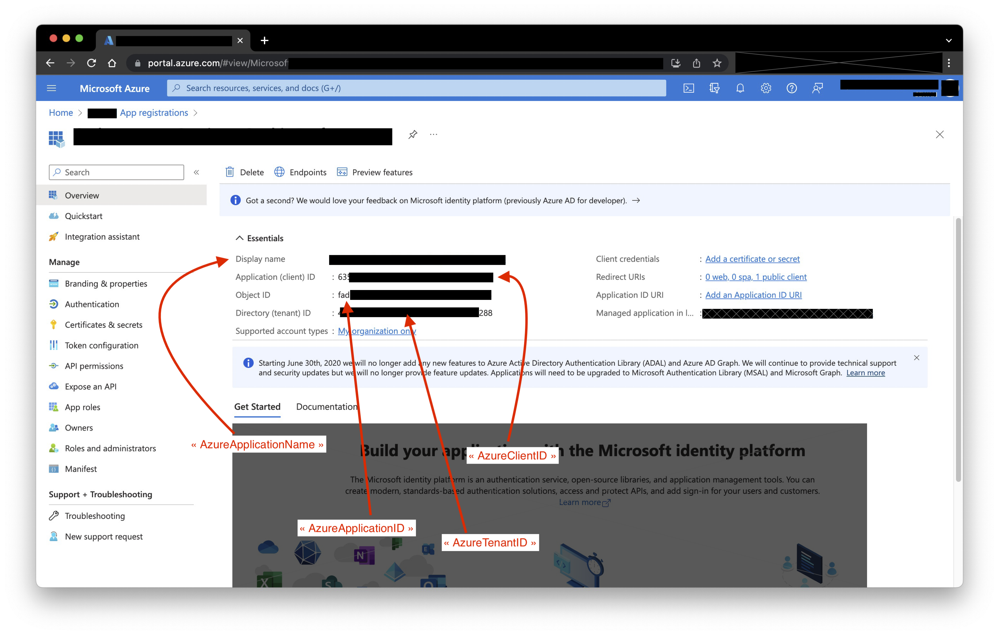
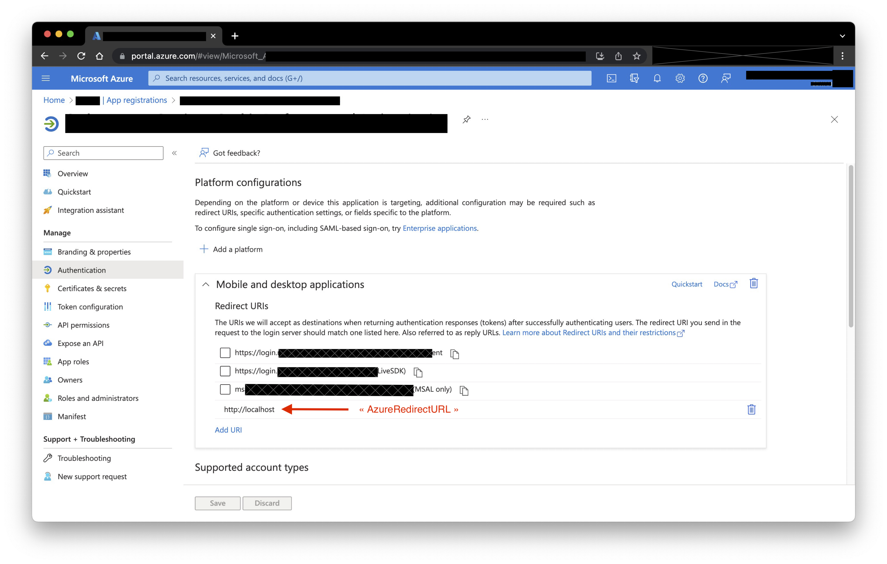
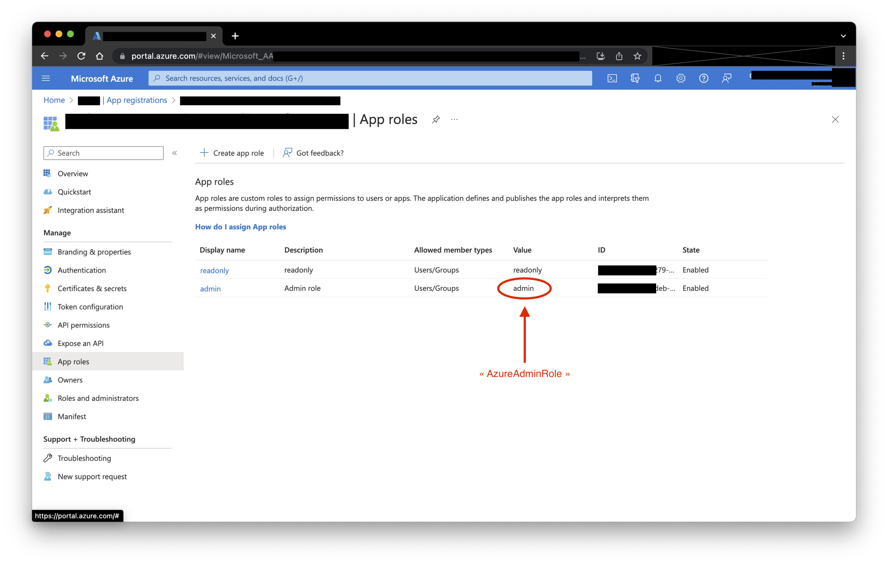
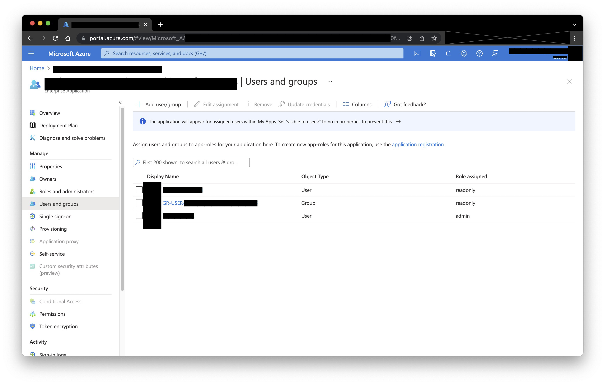

# Security

## Microsoft Azure AD Authentication

### 1. Create the Azure Application

First of all, you need to register an application on Azure.

This must be done from [https://portal.azure.com/](https://portal.azure.com/)

You can follow the Microsoft documentation [Quickstart: Register an application with the Microsoft identity platform](https://learn.microsoft.com/en-us/azure/active-directory/develop/quickstart-register-app) if you don't know how to do this.

The only important point, is for the "Platform Configurations", you need to set it as "Mobile and desktop applications" with the redirect URI as "http://localhost".

### 2. Configuration in `Orchestrator`

Add the following to `orchestrator`'s configuration file:

       "AuthenticationMethod": "azure",
       "AzureClientID": "<application_client_id>",
       "AzureTenantID": "<directory (tenant) ID>",
       "AzureGraphUserScope": "User.Read",
       "AzureRedirectURL": "http://localhost",
       "AzureApplicationName": "<display_name>",
       "AzureApplicationID": "<object_id>",
       "AzureAdminRole": "<app_roles_value>",

