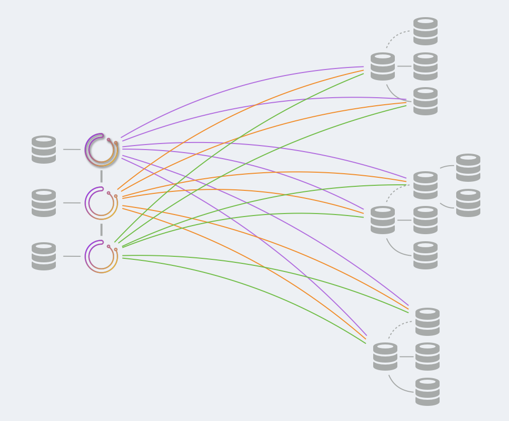

# Orchestrator deployment: raft

This text describes deployments for [orchestrator on raft](raft.md).

This follows general [deployment](deployment.md).

### Backend DB

You may choose between using `MySQL` and `SQLite`. See [backend configuration](configuration-backend.md).

- For MySQL:
  - The backend servers will be standalone. No replication setup. Each `orchestrator` node will interact with its own dedicated backend server.
  - You _must_ have a `1:1` mapping `orchestrator:MySQL`.
  - Suggestion: run `orchestrator` and its dedicated MySQL server on same box.
  - Make sure to `GRANT` privileges for the `orchestrator` user on each backend node.

- For `SQLite`:
  - `SQLite` is bundled with `orchestrator`.
  - Make sure the `SQLite3DataFile` is writable to the `orchestrator` user.

### High availability

`orchestrator` high availability is gained by using `raft`. You do not need to take care of backend DB high availability.

### What to deploy: service

- Deploy the `orchestrator` service onto service boxes.
  As suggested, you may want to put `orchestrator` service and `MySQL` service on same box. If using `SQLite` there's nothing else to do.

- Consider adding a proxy on top of the service boxes; the proxy would redirect all traffic to the leader node. There is one and only one leader node, and the status check endpoint is `/api/leader-check`.
  - Clients may _only iteract with the leader_. Setting up a proxy is one way to ensure that. See [proxy section](raft.md#proxy).
  - Nothing should directly interact with a backend DB. Only the leader is capable of coordinating changes to the data with the other `raft` nodes.

- `orchestrator` nodes communicate between themselves on `DefaultRaftPort`. This port should be open to all `orchestrator` nodes, and no one else needs to have access to this port.

### What to deploy: client

To interact with orchestrator from shell/automation/scripts, you may choose to:

- Directly interact with the HTTP API
  - You may only interact with the _leader_. A good way to achieve this is using a proxy.
- Use the [orchestrator-client](orchestrator-client.md) script.
  - Deploy `orchestrator-client` on any box from which you wish to interact with `orchestrator`.
  - Create and edit `/etc/profile.d/orchestrator-client.sh` on those boxes to read:
    ```
    ORCHESTRATOR_API="http://your.orchestrator.service.proxy:80/api"
    ```
    or
    ```
    ORCHESTRATOR_API="http://your.orchestrator.service.host1:80/api http://your.orchestrator.service.host2:80/api http://your.orchestrator.service.host3:80/api"
    ```
    In the latter case you will provide the list of all `orchestrator` nodes, and the `orchetsrator-client` script will automatically figure out which is the leader. With this setup your automation will not need a proxy (though you may still wish to use a proxy for web interface users).

    Make sure to chef/puppet/whatever the `ORCHESTRATOR_API` value such that it adapts to changes in your environment.

You may _not_ use the `orchestrator` command line client. Fortunately `orchestrator-client` provides an almost identical interface as the command lien client.

### Orchestrator service

As noted, a single `orchestrator` node will assume leadership. Only the leader will:

- Run recoveries

However all nodes will:

- Discover (probe) your MySQL topologies
- Run failure detection
- Register their own health check

None-leader nodes may _NOT_:

- Run arbitrary commands (e.g. `relocate`, `begin-downtime`)
- Run recoveries per human request.
- Serve client HTTP requests (but some endpoints, such as load-balancer and health checks, are valid).

### A visual example



In the above there are three `orchestrator` nodes in a `raft` cluster, each using its own dedicated database (either `MySQL` or `SQLite`).

`orchestrator` nodes communicate with each other.

Only one `orchestrator` node is the leader.

All `orchestrator` nodes probe the entire `MySQL` fleet. Each `MySQL` server is probed by each of the `raft` members.
