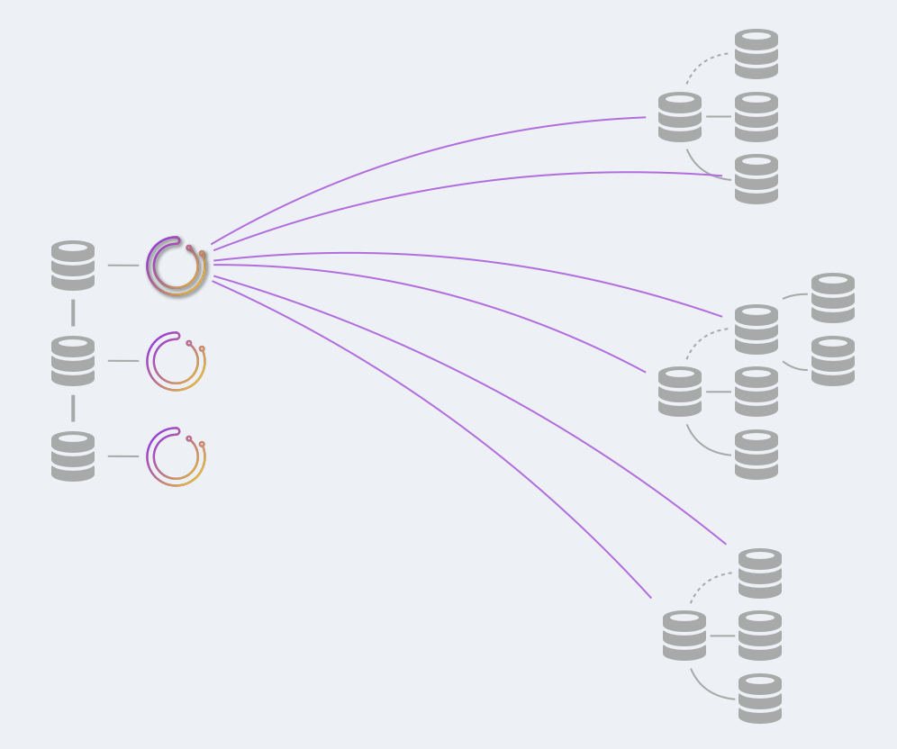

# Orchestrator deployment: shared backend

This text describes deployments for shared backend DB. See [High availability](high-availability.md) for the various backend DB setups.

This complements general [deployment](deployment.md) documentation.

### Shared backend

You will need to set up a shared backend database. This could be synchronous replication (Galera/XtraDB Cluster/InnoDB Cluster) for high availability, or it could be a master-replicas setup etc.

The backend database has the _state_ of your topologies. `orchestrator` itself is almost stateless, and trusts the data in the backend database.

In a shared backend setup multiple `orchestrator` services will all speak to the same backend.

- For **synchronous replication**, the advice is:
  - Configure multi-writer mode (each node in the MySQL cluster is writable)
  - Have `1:1` mapping between `orchestrator` services and `MySQL` nodes: each `orchestrator` service to speak with its own node.
- For **master-replicas** (asynchronous & semi-synchronous), do:
  - Configure all `orchestrator` nodes to access the _same_ backend DB (the master)
  - Optionally you will have your own load balancer to direct traffic to said master, in which case configure all `orchestrator` nodes to access the proxy.

### MySQL backend setup and high availability

Setting up the backend DB is on you. Also, `orchestartor` doesn't eat its own dog food, and cannot recover a failure on its own backend DB.
You will need to handle, for example, the issue of adding a Galera node, or of managing your proxy health checks etc.

### What to deploy: service

- Deploy the `orchestrator` service onto service boxes. The decision of how many service boxes  to deploy
  will depend on your [availability needs](high-availability.md).
  - In a synchronous replication shared backend setup, these may well be the very MySQL boxes, in a `1:1` mapping.
- Consider adding a proxy on top of the service boxes; the proxy would ideally redirect all traffic to the leader node. There is one and only one leader node, and the status check endpoint is `/api/leader-check`. It is OK to direct traffic to any healthy service. Since all `orchestrator` nodes speak to the same shared backend DB, it is OK to operate some actions from one service node, and other actions from another service nodes. Internal locks are placed to avoid running contradicting or interfering commands.


### What to deploy: client

To interact with orchestrator from shell/automation/scripts, you may choose to:

- Directly interact with the HTTP API
- use the [orchestrator-client](orchestrator-client.md) script.
  - Deploy `orchestrator-client` on any box from which you wish to interact with `orchestrator`.
  - Create and edit `/etc/profile.d/orchestrator-client.sh` on those boxes to read:
    ```
    ORCHESTRATOR_API="http://your.orchestrator.service.proxy:80/api"
    ```
    or
    ```
    ORCHESTRATOR_API="http://your.orchestrator.service.host1:3000/api http://your.orchestrator.service.host2:3000/api http://your.orchestrator.service.host3:3000/api"
    ```
    In the latter case you will provide the list of all `orchestrator` nodes, and the `orchetsrator-client` script will automatically figure out which is the leader. With this setup your automation will not need a proxy (though you may still wish to use a proxy for web interface users).

    Make sure to chef/puppet/whatever the `ORCHESTRATOR_API` value such that it adapts to changes in your environment.

- The [orchestrator command line](executing-via-command-line.md).
  - Deploy the `orchestrator` binary (you may use the `orchestrator-cli` distributed package) on any box from which you wish to interact with `orchestrator`.
  - Create `/etc/orchestrator.conf.json` on those boxes, populate with credentials. This file should generally be the same as for the `orchestrator` service boxes. If you're unsure, use exact same file content.
  - The `orchestrator` binary will access the shared backend DB. Make sure to give it access. Typically this will be port `3306`.

It is OK to run `orchestrator` CLI even while the `orchestrator` service is operating, since they will all coordinate on the same backend DB.

### Orchestrator service

In a shared-backend deployment, you may deploy the number of `orchestrator` nodes as suits your requirements. 

However, as noted, one `orchestrator` node will be [elected leader](http://code.openark.org/blog/mysql/leader-election-using-mysql). Only the leader will:

- Discover (probe) your MySQL topologies
- Run failure detection
- Run recoveries

All nodes will:

- Serve HTTP requests
- Register their own health check

All nodes may:

- Run arbitrary command (e.g. `relocate`, `begin-downtime`)
- Run recoveries per human request.

For more details about deploying multiple nodes, please read about [high availability](high-availability.md).

### Orchestrator CLI

The CLI executes to fulfill a specific operation. It may choose to probe a few servers, depending on the operation (e.g. `relocate`), or it may probe no server at all and just read data from the backend DB.

### A visual example



In the above there are three `orchestrator` nodes running on top of a `3` node synchronous replication setup. Each `orchestrator` nodes speaks to a different `MySQL` backend, but those are replicated synchronously and all share the same picture (up to some lag).

One `orchestrator` node is elected as leader, and only that node probes the MySQL topologies. It probes all known servers (the above image only shows part of the probes to avoid the spaghetti).
