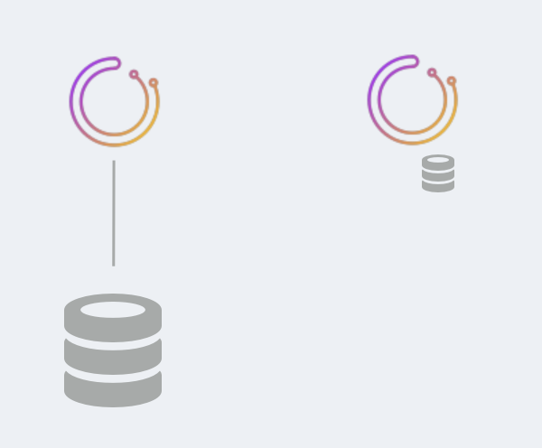
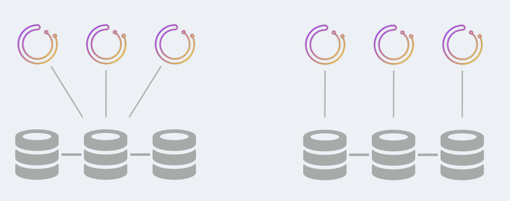
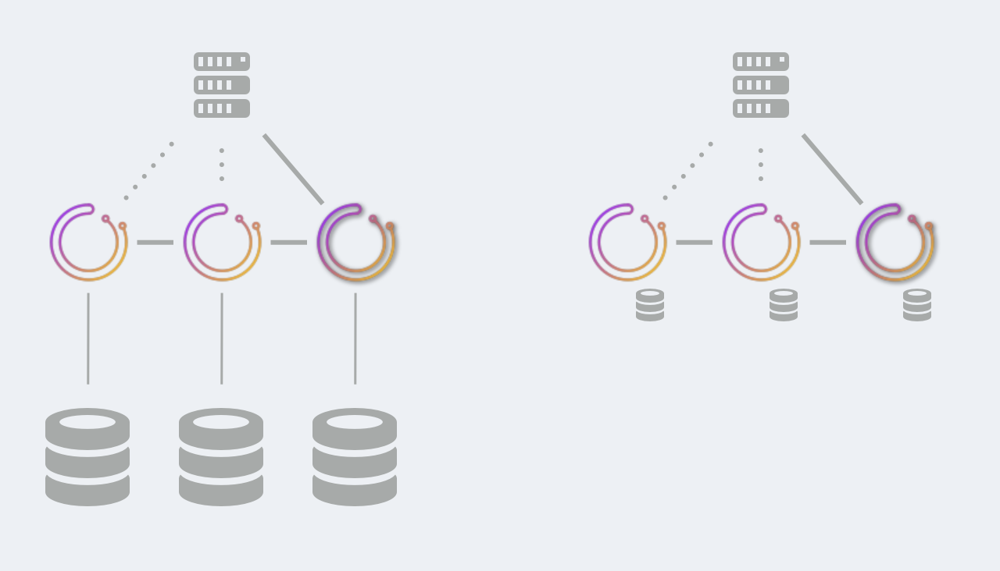

# Orchestrator High Availability

`orchestrator` runs as a highly available service. This document lists the various ways of achieving HA for `orchestrator`, as well as less/not highly available setups.

### TL;DR ways to get HA

HA is achieved by choosing either:

- `orchestrator/raft` setup, where `orchestrator` nodes communicate by raft consensus. Each `orchestrator` node [has a private database backend](#ha-via-raft), either `MySQL` or `sqlite`. See also [orchestrator/raft documentation](raft.md)
- [Shared backend](#ha-via-shared-backend) setup. Multiple `orchestrator` nodes all talk to the same backend, which may be a Galera/XtraDB Cluster/InnoDB Cluster/NDB Cluster. Synchronization is done at the database level.

See also: [orchestrator/raft vs. synchronous replication setup](raft-vs-sync-repl.md)

### Availability types

You may choose different availability types, based on your requirements.

- No high availability: easiest, simplest setup, good for testing or dev setups. Can use `MySQL` or `sqlite`
- Semi HA: backend is based on normal MySQL replication. `orchestrator` does not eat its own dog food and cannot failover its own backend.
- HA: as depicted above; support for no single point of failure. Different solutions have different tradeoff in terms of resource utilization, supported software, type of client access.

Discussed below are all options.

### No high availability

This setup is good for CI testing, for local dev machines or otherwise experiments. It is a single-`orchestrator` node with a single DB backend.

The DB backend may be a `MySQL` server or it may be a `sqlite` DB, bundled with `orchestrator` (no dependencies, no additional software required)

### Semi HA

This setup provides semi HA for `orchestrator`. Two variations available:

- Multiple `orchestrator` nodes talk to the same backend database. HA of the `orchestrator` services is achieved. However HA of the backend database is not achieved. Backend database may be a `master` with replicas, but `orchestrator` is unable to eat its own dog food and failover its very backend DB.

  If the backend `master` dies, it takes someone or something else to failover the `orchestrator` service onto a promoted replica.

- Multiple `orchestrator` services all talk to a proxy server, which load balances an active-active `MySQL` master-master setup with `STATEMENT` based replication.

  - The proxy always directs to same server (e.g. `first` algorithm for `HAProxy`) unless that server is dead.
  - Death of the active master causes `orchestrator` to talk to other master, which may be somewhat behind. `orchestrator` will typically self reapply the missing changes by nature of its continuous discovery.
  - `orchestrator` queries guarantee `STATEMENT` based replication will not cause duplicate errors, and master-master setup will always achieve consistency.
  - `orchestrator` will be able to recover the death of a backend master even if in the middle of runnign a recovery (recovery will re-initiate on alternate master)
  - **Split brain is possible**. Depending on your setup, physical locations, type of proxy, there can be different `orchestrator` service nodes speaking to different backend `MySQL` servers. This scenario can lead two two `orchestrator` services which consider themselves as "active", both of which will run failovers independently, which would lead to topology corruption.

To access your `orchestrator` service you may speak to any healthy node.

Both these setups are well known to run in production for very large environments.

### HA via shared backend

HA is achieved by highly available shared backend. Existing solutions are:

- Galera
- XtraDB Cluster
- InnoDB Cluster
- NDB Cluster

In all of the above the MySQL nodes run synchronous replication (using the common terminology).

Two variations exist:

- Your Galera/XtraDB Cluster/InnoDB Cluster runs with a single-writer node. Multiple `orchestrator` nodes will speak to the single writer DB, probably via proxy. If the writer DB fails, the backend cluster promotes a different DB as writer; it is up to your proxy to identify that and direct `orchestrator`'s traffic to the promoted server.

- Your Galera/XtraDB Cluster/InnoDB Cluster runs in multiple writers mode. A nice setup would couple each `orchestrator` node with a DB server (possibly on the very same box). Since replication is synchronous there is no split brain. Only one `orchestrator` node can ever be the leader, and that leader will only speak with a consensus of the DB nodes.

In this setup there could be a substantial amount of traffic between the MySQL nodes. In cross-DC setups this may imply larger commit latencies (each commit may need to travel cross DC).

To access your `orchestrator` service you may speak to any healthy node. It is advisable you speak only to the leader via proxy (use `/api/leader-check` as HTTP health check for your proxy).

The latter setup is known to run in production at a very large environment on `3` or `5` nodes setup.

### HA via raft

`orchestrator` nodes will directly communicate via `raft` consensus algorithm. Each `orchestrator` node has its own private backend database. This can be `MySQL` or `sqlite`.

Only one `orchestrator` node assumes leadership, and is always a part of a consensus. However all other nodes are independently active and are polling your topologies.

In this setup there is:
- No communication between the DB nodes.
- Minimal communication between the `orchestrator`.
- `*n` communication to `MySQL` topology nodes. A `3` node setup means each topology `MySQL` server is probed by `3` different `orchestrator` nodes, independently.

It is recommended to run a `3`-node or a `5`-node setup.

`sqlite` is embedded within `orchestrator` and does not require an external dependency. `MySQL` outperforms `sqlite` on busy setups.

To access your `orchestrator` service you may **only** speak to the leader node.
- Use `/api/leader-check` as HTTP health check for your proxy.
- Or use [orchestrator-client](orchestrator-client.md) with multiple `orchestrator` backends; `orchestrator-client` will figure out the identity of the leader and will send requests to the leader.

`orchestrator/raft` is a newer development, and is being tested in production at this time. Please read the [orchestrator/raft documentation](raft.md) for all implications.
