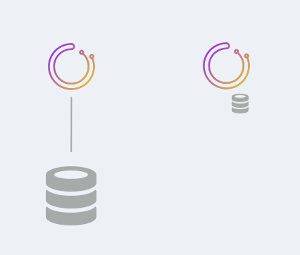
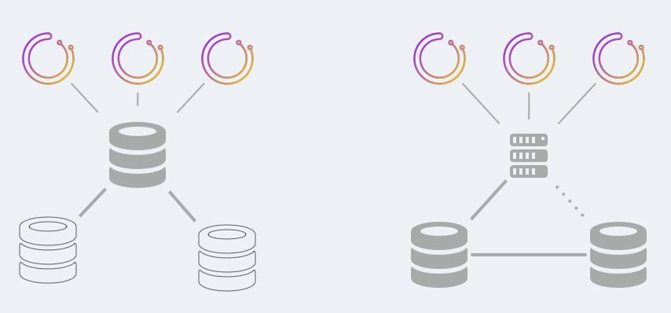
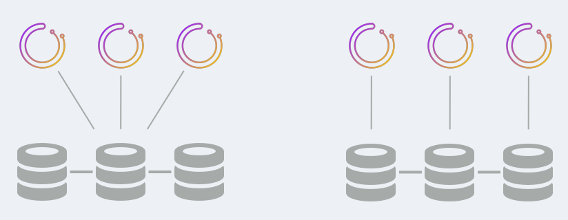
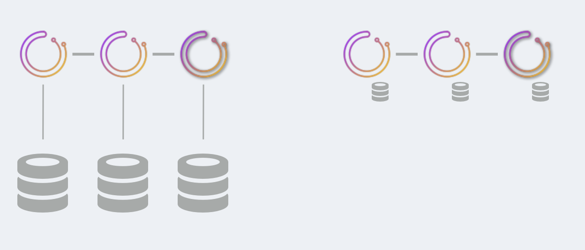
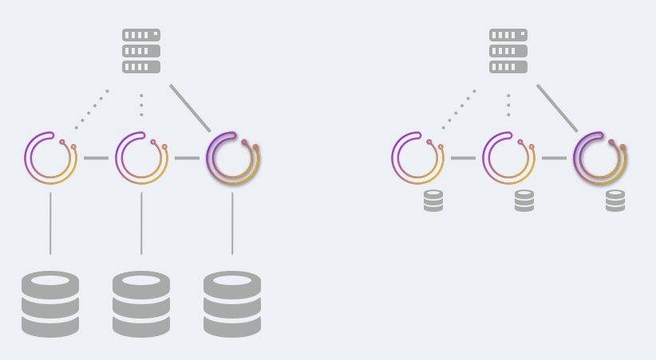

# Orchestrator High Availability

`orchestrator` runs as a highly available service. This document lists the various ways of achieving HA for `orchestrator`, as well as less/not highly available setups.

### TL;DR ways to get HA

HA is achieved by choosing either:

- `orchestrator/raft` setup, where `orchestrator` nodes communicate by raft consensus. Each `orchestrator` node has a private database backend, either `MySQL` or `sqlite`. See also [orchestrator/raft documentation](raft.md)
- Shared backend setup. Multiple `orchestrator` nodes all talk to the same backend, which may be a Galera/XtraDB Cluster/InnoDB Cluster/NDB Cluster. Synchronization is done at the database level.

### Availability types

You may choose different availability types, based on your requirements.

- No high availability: easiest, simplest setup, good for testing or dev setups. Can use `MySQL` or `sqlite`
- Semi HA: backend is based on normal MySQL replication. `orchestrator` does not eat its own dog food and cannot failover its on backend.
- HA: as depicted above; support for no single point of failure. Different solutions have different tradeoff in terms of resource utilization, supported software, type of client access.

Discussed below are all options.

### No high availability

This setup is good for CI testing, for local dev machines or otherwise experiments. It is a single-`orchestrator` node with a single DB backend.

The DB backend may be a `MySQL` server or it may be a `sqlite` DB, bundled with `orchestrator` (no dependencies, no additional software required)

### Semi HA

This setup provides semi HA for `orchestrator`. Two variations available:

- Multiple `orchestrator` nodes talk to the same backend database. HA of the `orchestrator` services is achieved. However HA of the backend database is not achieved. Backend database may be a `master` with replicas, but `orchestrator` is unable to eat its own dog food and failover its very backend DB.

  If the backend `master` dies, it takes someone or something else to failover the `orchestrator` service onto a promoted replica.

- Multiple `orchestrator` services all talk to a proxy server, which load balances an active-active `MySQL` master-master setup with `STATEMENT` based replication.

  - The proxy always directs to same server (e.g. `first` algorithm for `HAProxy`) unless that server is dead.
  - Death of the active master causes `orchestrator` to talk to other master, which may be somewhat behind. `orchestrator` will typically self reapply the missing changes by nature of its continuous discovery.
  - `orchestrator` queries guarantee `STATEMENT` based replication will not cause duplicate errors, and master-master setup will always achieve consistency.
  - `orchestrator` will be able to recover the death of a backend master even if in the middle of runnign a recovery (recovery will re-initiate on alternate master)
  - **Split brain is possible**. Depending on your setup, physical locations, type of proxy, there can be different `orchestrator` service nodes speaking to different backend `MySQL` servers. This scenario can lead two two `orchestrator` services which consider themselves as "active", both of which will run failovers independently, which would lead to topology corruption.

To access your `orchestrator` service you may speak to any healthy node.

Both these setups are well known to run in production for very large environments.

### HA via shared backend

HA is achieved by highly available shared backend. Existing solutions are:

- Galera
- XtraDB Cluster
- InnoDB Cluster
- NDB Cluster

In all of the above the MySQL nodes run synchronous replication (using the common terminology).

Two variations exist:

- Your Galera/XtraDB Cluster/InnoDB Cluster runs with a single-writer node. Multiple `orchestrator` nodes will speak to the single writer DB, probably via proxy. If the writer DB fails, the backend cluster promotes a different DB as writer; it is up to your proxy to identify that and direct `orchestrator`'s traffic to the promoted server.

- Your Galera/XtraDB Cluster/InnoDB Cluster runs in multiple writers mode. A nice setup would couple each `orchestrator` node with a DB server (possibly on the very same box). Since replication is synchronous there is no split brain. Only one `orchestrator` node can ever be the leader, and that leader will only speak with a consensus of the DB nodes.

In this setup there could be a substantial amount of traffic between the MySQL nodes. In cross-DC setups this may imply larger commit latencies (each commit may need to travel cross DC).

To access your `orchestrator` service you may speak to any healthy node. It is advisable you speak only to the leader via proxy (use `/api/leader-check` as HTTP health check for your proxy).

The latter setup is known to run in production at a very large environment on `3` or `5` nodes setup.

### HA via raft

`orchestrator` nodes will directly communicate via `raft` consensus algorithm. Each `orchestrator` node has its own private backend database. This can be `MySQL` or `sqlite`.

Only one `orchestrator` node assumes leadership, and is always a part of a consensus. However all other nodes are independently active and are polling your topologies.

In this setup there is:
- No communication between the DB nodes.
- Minimal communication between the `orchestrator`.
- `*n` communication to `MySQL` topology nodes. A `3` node setup means each topology `MySQL` servr is probed by `3` different `orchestrator` nodes, independently.

It is recommended to run a `3`-node or a `5`-node setup.

To access your `orchestrator` service you may **only** speak to the leader node. Use `/api/leader-check` as HTTP health check for your proxy.

`orchestrator/raft` is a newer development, and is being tested in production at this time. Please read the [orchestrator/raft documentation](raft.md) for all implications.

===

`Orchestrator` makes your MySQL topologies available, but what makes `orchestrator` highly available?

Before drilling down into the details, we should first observe that orchestrator is a service that runs with a MySQL backend. Thus, we need to substantiate the HA of both these components, as well as the continued correctness in the failover process of either of the two or of both.

### High Availability of the Orchestrator service

`Orchestrator` runs as a service and its configuration needs to
reference a MySQL backend. You can quite easily add more orchestrator
applications probably running on different hosts to provide redundancy.
These servers would have an identical configuration.  `Orchestrator`
uses the database to record the different applications which are
running and through it will allow an election process to choose one
of the processes to be the active node.  If that process fails the
remaining processes will notice and shortly afterwards choose a new
active node. The active node is the one which periodically checks
each of the MySQL servers being monitored to determine if they are
healthy.  If it detects a failure it will recover the topology if
so configured.

If you use the web interface to look at the topology information
or to relocate replicas within a cluster and you have multiple
orchestrator processes running then you need to use a load balancer
to provide the redundant web service through a common URL.  Requests
through the load balancer may not hit the active node but that is
not an issue as any of the running processes can serve the web
requests.

### High Availability of the Orchestrator backend database

At this time `Orchestrator` relies on a MySQL backend. The state of the clusters is persisted to tables and is queried via SQL. It is worth considering the following:

- The backend database is very small, and is linear with your number of servers. For most setups it's a matter of a few MB and well below 1GB, depending on history configuration, rate of polling etc. This easily allows for a fully in-memory database even on simplest machines.

- Write rate is dependent on the frequency the MySQL hosts are polled and the number of servers involved.  For most orchestrator installations the write rate is low.

To that extent you may use one of the following solutions in order to make the backend database highly available:

- 2-node MySQL Cluster
  This is a synchronous solution; anything you write on one node is guaranteed to exist on the second. Data is available and up to date even in the face of a death of one server.
  Suggestion: abstract via HAProxy with `first` load-balancing algorithm.
  > NOTE: right now table creation explicitly creates tables using InnoDB engine; you may `ALTER TABLE ... ENGINE=NDB`

- 3-node Galera/XtraDB cluster
  This is a synchronous solution; anything you write on one node is guaranteed to exist on both other servers.
  Galera is eventually consistent.
  Data is available and up to date even in the face of a death of one server.
  Suggestion: abstract via HAProxy with `first` load-balancing algorithm.

- MySQL Group Replication
  This is similar to the MySQL Cluster (but uses the InnoDB engine) or the Galera/XtraDB cluster and is available in MySQL 5.7.17 (December 2016) and later.
  Similar considerations apply as for the previous two options.

- 2-node active-passive master-master configuration

> NOTE: there has been an initial discussion on supporting Consul/etcd as backend datastore; there is no pending work on that at this time.
