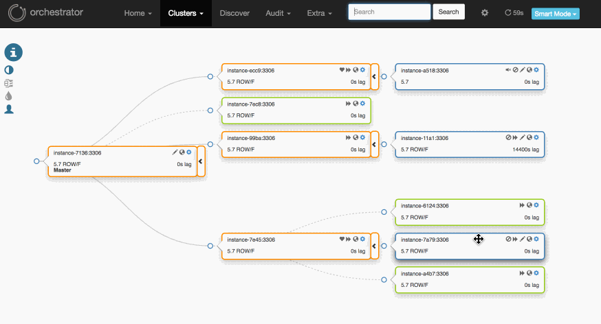

# Pseudo GTID

Pseudo GTID is the method of injecting unique entries into the binary logs, such that they can be used to
match/sync replicas without direct connection, or replicas whose master is corrupted/dead.

Pseudo-GTID is attractive to users not using GTID. Pseudo-GTID has most of GTID's benefits, but without making the commitment GTID requires. With Pseudo-GTID you can keep your existing topologies, whichever version of MySQL you're running.

### Advantages of Pseudo-GTID

- Enable master failovers.
- Enable intermediate master failovers.
- Arbitrary refactoring, relocating replicas from one place to another (even those replicas that don't have binary logging).
- Vendor neutral; works on both Oracle and MariaDB, even both combined.
- No configuration changes. Your replication setup remains as it is.
- No commitment. You can choose to move away from Pseudo-GTID at any time; just stop writing P-GTID entries.
- Pseudo-GTID implies crash-safe replication for replicas running with:
  - `log-slave-updates`
  - `sync_binlog=1`
- As opposed to GTID on MySQL `5.6`, servers don't _have to_ run with `log-slave-updates`, though `log-slave-updates` is recommended.

### Automated Pseudo-GTID injection

`orchestrator` can inject Pseudo-GTID entries for you. See [Automated Pseudo-GTID](configuration-discovery-pseudo-gtid.md#automated-pseudo-gtid-injection)

### Manual Pseudo-GTID injection

Automated Pseudo-GTID is a later addition which supersedes the need for manual Pseudo-GTID injection, and is recommended. However, you may still choose to inject your own Pseudo-GTID.

See [Manual Pseudo-GTID injection](pseudo-gtid-manual-injection.md)

### Limitations
- Active-Active master-master replication not supported
  - Active-passive master-master replication, where Pseudo-GTID is injected on the active master only, _is supported_.
- Replicas that don't run `log-slave-updates` are synced via relay logs. MySQL's default aggressive purging of relay logs implies that if a crash happens on a master, and a replica's relay logs have just been rotated (i.e. immediately also purged), then there's no Pseudo-GTID info in the relay logs to use for healing the topology
  - Frequent injections of P-GTID mitigate this problem. We inject P-GTID every `5sec`.
- When a replica reads Statement Based Replication relay logs and relays Row Based Replication binary logs (i.e. master has `binlog_format=STATEMENT` and replica has `binlog_format=ROW`), then `orchestrator` matches Pseudo-GTID via relay logs. See the above bullet for limitations on relay logs.
- You cannot match two servers where one is fully RBR (receives and writes Row Based Replication logs) and the other is fully SBR. Such scenario can happen when migrating from SBR based topology to RBR topology.
- An edge case scenario is known when replicating from `5.6` to `5.7`: `5.7` adds `ANONYMOUS` statements to the binary logs, which `orchestrator` knows how to skip. However if `5.6`->`5.7` replication breaks (e.g. dead master) and an `ANONYMOUS` statement is the last statement in the binary log, `orchestrator` is unable at this time to align the servers.


### Deploying Pseudo-GTID

Please follow [deployment, Pseudo-GTID](deployment.md#pseudo-gtid).

#### Using Pseudo GTID

Via web:



Via command line:

```
orchestrator-client -c relocate -i some.server.to.relocate -d under.some.other.server
```

The `relocate` command will auto-identify that Pseudo-GTID is enabled.
