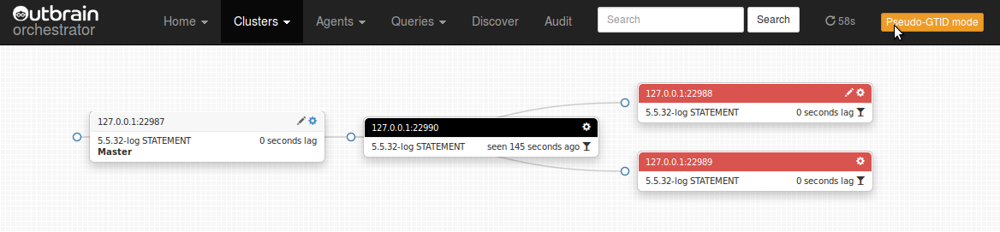
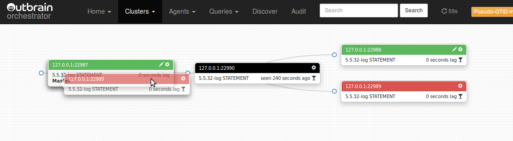

# Pseudo GTID

Pseudo GTID is the method of injecting unique entries into the binary logs, such that they can be used to
match/sync slaves without direct connection, or slaves whose master is corrupted/dead.

`Orchestrator` leverages Pseudo GTID, when applicable, and allows for complex re-matching of slaves, including
semi-automated fail over onto a slave and the moving of its siblings as its slaves.

To enable Pseudo GTID you need to:

1. Frequently inject a unique entry into the binary logs
2. Configure orchestrator to recognize such an entry
3. Optionaly hint to orchestrator that such entries are in ascending order

Injecting an entry in the binary log is a matter of issuing a statement. Depending on whether you're using
statement based replication or row based replication, such a statement could be an `ISNERT`, `CREATE` or other.
Please consult these blog entries:
[Pseudo GTID](http://code.openark.org/blog/mysql/pseudo-gtid),
[Pseudo GTID, Row Based Replication](http://code.openark.org/blog/mysql/pseudo-gtid-row-based-replication),
[Refactoring replication topology with Pseudo GTID](http://code.openark.org/blog/mysql/refactoring-replication-topology-with-pseudo-gtid)
for more detail.

Following are three examples of workeable injection of GTID and the accompanying `orchestrator` configuration:

#### Pseudo GTID via CREATE OR REPLACE VIEW

```sql
create database if not exists meta;

drop event if exists meta.create_pseudo_gtid_view_event;

delimiter ;;
create event if not exists
  meta.create_pseudo_gtid_view_event
  on schedule every 10 second starts current_timestamp
  on completion preserve
  enable
  do
    begin
      set @pseudo_gtid := uuid();
      set @_create_statement := concat('create or replace view meta.pseudo_gtid_view as select \'', @pseudo_gtid, '\' as pseudo_gtid_unique_val from dual');
      PREPARE st FROM @_create_statement;
      EXECUTE st;
      DEALLOCATE PREPARE st;
    end
;;

delimiter ;

set global event_scheduler := 1;
```

   and the matching configuration entry:

```json
{
    "PseudoGTIDPattern": "CREATE OR REPLACE .*? VIEW `pseudo_gtid_view` AS select"
}
```

The advantage of the above method is that it not only shows up in the binary/relay logs (which is the single requirement),
but also provides information via `SELECT` queries.

Disadvantage of the above is metadata locking. On very busy servers the `CREATE/REPLACE` statement can hold table cache
or other locks. We've seen this stall replication on slaves.


#### Pseudo GTID via DROP VIEW IF EXISTS

```sql
create database if not exists meta;
use meta;

drop event if exists create_pseudo_gtid_event;
delimiter $$
create event if not exists
  create_pseudo_gtid_event
  on schedule every 5 second starts current_timestamp
  on completion preserve
  enable
  do
    begin
      set @pseudo_gtid_hint := uuid();
      set @_create_statement := concat('drop ', 'view if exists `meta`.`_pseudo_gtid_', 'hint__', @pseudo_gtid_hint, '`');
      PREPARE st FROM @_create_statement;
      EXECUTE st;
      DEALLOCATE PREPARE st;
    end
$$

delimiter ;

set global event_scheduler := 1;
```

   and the matching configuration entry:

```json
{
  "PseudoGTIDPattern": "drop view if exists .*?`_pseudo_gtid_hint__"
}
```

The above attempts to drop a view which does not actually exist. The statement does nothing in reality, and yet
propagates through replication stream. As opposed to previous example, it will not use excessive locking.

The disadvantage of this method is that it only shows in the binary logs, and have no data visibility (cannot
`SELECT` to see Pseudo-GTID status).


#### Pseudo GTID via DROP VIEW IF EXISTS & INSERT INTO ... ON DUPLICATE KEY UPDATE

This third method adds to the previous one by actually invoking two statements. One (DDL) will be visible in the
binary/relay logs. The other (DML) will affect data.

```sql
create database if not exists meta;
use meta;

create table if not exists pseudo_gtid_status (
  anchor                      int unsigned not null,
  originating_mysql_host      varchar(128) charset ascii not null,
  originating_mysql_port      int unsigned not null,
  originating_server_id       int unsigned not null,
  time_generated              timestamp not null default current_timestamp,
  pseudo_gtid_uri             varchar(255) charset ascii not null,
  pseudo_gtid_hint            varchar(255) charset ascii not null,
  PRIMARY KEY (anchor)
);

drop event if exists create_pseudo_gtid_event;
delimiter $$
create event if not exists
  create_pseudo_gtid_event
  on schedule every 5 second starts current_timestamp
  on completion preserve
  enable
  do
    begin
      DECLARE lock_result INT;
      DECLARE CONTINUE HANDLER FOR SQLEXCEPTION BEGIN END;

      set @pseudo_gtid_hint := uuid();
      set @_create_statement := concat('drop ', 'view if exists `meta`.`_pseudo_gtid_', 'hint__', @pseudo_gtid_hint, '`');
      PREPARE st FROM @_create_statement;
      EXECUTE st;
      DEALLOCATE PREPARE st;

      /*!50600
      SET innodb_lock_wait_timeout = 1;
      */
      SET lock_result = GET_LOCK('pseudo_gtid_status', 0);
      IF lock_result = 1 THEN
        set @serverid := @@server_id;
        set @hostname := @@hostname;
        set @port := @@port;
        set @now := now();
        set @rand := floor(rand()*(1 << 32));
        set @pseudo_gtid := concat('pseudo-gtid://', @hostname, ':', @port, '/', @serverid, '/', date(@now), '/', time(@now), '/', @rand);
        insert into pseudo_gtid_status (
             anchor,
             originating_mysql_host,
             originating_mysql_port,
             originating_server_id,
             time_generated,
             pseudo_gtid_uri,
             pseudo_gtid_hint
          )
      	  values (1, @hostname, @port, @serverid, @now, @pseudo_gtid, @pseudo_gtid_hint)
      	  on duplicate key update
      		  originating_mysql_host = values(originating_mysql_host),
      		  originating_mysql_port = values(originating_mysql_port),
      		  originating_server_id = values(originating_server_id),
      		  time_generated = values(time_generated),
       		  pseudo_gtid_uri = values(pseudo_gtid_uri),
       		  pseudo_gtid_hint = values(pseudo_gtid_hint)
        ;
        SET lock_result = RELEASE_LOCK('pseudo_gtid_status');
      END IF;
    end
$$

delimiter ;

set global event_scheduler := 1;
```

   and the matching configuration entries:

```json
{
  "PseudoGTIDPattern": "drop view if exists .*?`_pseudo_gtid_hint__",
  "DetectPseudoGTIDQuery": "select count(*) as pseudo_gtid_exists from meta.pseudo_gtid_status where anchor = 1 and time_generated > now() - interval 2 day"
}
```

Note that we introduce the `DetectPseudoGTIDQuery` config, which allows `orchestrator` to actually check if Pseudo-GTID was recently injected.

In the above routine you may notice significant code overhead (`DECLATE CONTINUE HANDLER`, `GET_LOCK`, ...). This code overhead makes for a
safety mechanism to avoid pileup of the `INSERT` statement in case the server happens to suffer some locking issue. Recall that the event scheduler
issues the code repeatedly, and even if the previous execution has not been terminated. This protection layer will support injection of Pseudo-GTID
on every execution, but will only allow one `INSERT` statement at a time. This comes from experience, trust it.


#### Ascending Pseudo GTID via DROP VIEW IF EXISTS & INSERT INTO ... ON DUPLICATE KEY UPDATE

Similar to the above, but Pseudo-GTID entries are inject in ascending lexical order. This allows orchestrator to perform further
optimizations when searching for a given Pseudo-GTID entry on a master's binary logs.


```sql
create database if not exists meta;
use meta;

create table if not exists pseudo_gtid_status (
  anchor                      int unsigned not null,
  originating_mysql_host      varchar(128) charset ascii not null,
  originating_mysql_port      int unsigned not null,
  originating_server_id       int unsigned not null,
  time_generated              timestamp not null default current_timestamp,
  pseudo_gtid_uri             varchar(255) charset ascii not null,
  pseudo_gtid_hint            varchar(255) charset ascii not null,
  PRIMARY KEY (anchor)
);

drop event if exists create_pseudo_gtid_event;
delimiter $$
create event if not exists
  create_pseudo_gtid_event
  on schedule every 5 second starts current_timestamp
  on completion preserve
  enable
  do
    begin
      DECLARE lock_result INT;
      DECLARE CONTINUE HANDLER FOR SQLEXCEPTION BEGIN END;

      set @connection_id := connection_id();
      set @now := now();
      set @rand := floor(rand()*(1 << 32));
      set @pseudo_gtid_hint := concat_ws(':', lpad(hex(unix_timestamp(@now)), 8, '0'), lpad(hex(@connection_id), 16, '0'), lpad(hex(@rand), 8, '0'));
      set @_create_statement := concat('drop ', 'view if exists `meta`.`_pseudo_gtid_', 'hint__asc:', @pseudo_gtid_hint, '`');
      PREPARE st FROM @_create_statement;
      EXECUTE st;
      DEALLOCATE PREPARE st;

      /*!50600
      SET innodb_lock_wait_timeout = 1;
      */
      SET lock_result = GET_LOCK('pseudo_gtid_status', 0);
      IF lock_result = 1 THEN
        set @serverid := @@server_id;
        set @hostname := @@hostname;
        set @port := @@port;
        set @pseudo_gtid := concat('pseudo-gtid://', @hostname, ':', @port, '/', @serverid, '/', date(@now), '/', time(@now), '/', @rand);
        insert into pseudo_gtid_status (
             anchor,
             originating_mysql_host,
             originating_mysql_port,
             originating_server_id,
             time_generated,
             pseudo_gtid_uri,
             pseudo_gtid_hint
          )
      	  values (1, @hostname, @port, @serverid, @now, @pseudo_gtid, @pseudo_gtid_hint)
      	  on duplicate key update
      		  originating_mysql_host = values(originating_mysql_host),
      		  originating_mysql_port = values(originating_mysql_port),
      		  originating_server_id = values(originating_server_id),
      		  time_generated = values(time_generated),
       		  pseudo_gtid_uri = values(pseudo_gtid_uri),
       		  pseudo_gtid_hint = values(pseudo_gtid_hint)
        ;
        SET lock_result = RELEASE_LOCK('pseudo_gtid_status');
      END IF;
    end
$$

delimiter ;

set global event_scheduler := 1;
```

   and the matching configuration entries:

```json
{
  "PseudoGTIDPattern": "drop view if exists .*?`_pseudo_gtid_hint__",
  "DetectPseudoGTIDQuery": "select count(*) as pseudo_gtid_exists from meta.pseudo_gtid_status where anchor = 1 and time_generated > now() - interval 2 day",
  "PseudoGTIDMonotonicHint": "asc:",
}
```

Note that the `@pseudo_gtid_hint` value is composed of UTC timestamp (encoded in hex) followed by other values (connection_id, random). This makes entries increasing in lexical order.

The `PseudoGTIDMonotonicHint` configuration variable tells `orchestrator` that if it finds the value (`asc:`) in the Pseudo-GTID entry text, then it is to be
trusted that said entry was injected as part of monotonicly increasing Pseudo-GTID entries. This will kick in a search optimization on the master's binary logs.


The author of `orchestrator` uses this last method injection.


#### Using Pseudo GTID

`orchestrator` will only enable Pseudo-GTID mode if the `PseudoGTIDPattern` configuration variable is non-empty,
but can only validate its correctness during runtime.

If your pattern is incorrect (thus, `orchestrator` in unable to find pattern in the binary logs), you will not be able
to move slaves in the topology via Pseudo-GTID, and you will only find this out upon attempting to.

If you manage more that one topology with `orchestrator`, you will need to use same Pseudo GTID injection method for all, as
there is only a single `PseudoGTIDPattern` value.

To move slaves via Pseudo-GTID mechanism, click the **Classic mode** green button on the navigation bar and turn it into
**Pseudo GTID mode**. The rules for dragging a slave change: any slave whose SQL thread is up-to-date with the IO-thread
(depicted by a win-glass icon) is eligible for dragging. At this point such a slave can be dropped on an accessible sibling
or ancestor (including its very own master/parent).







