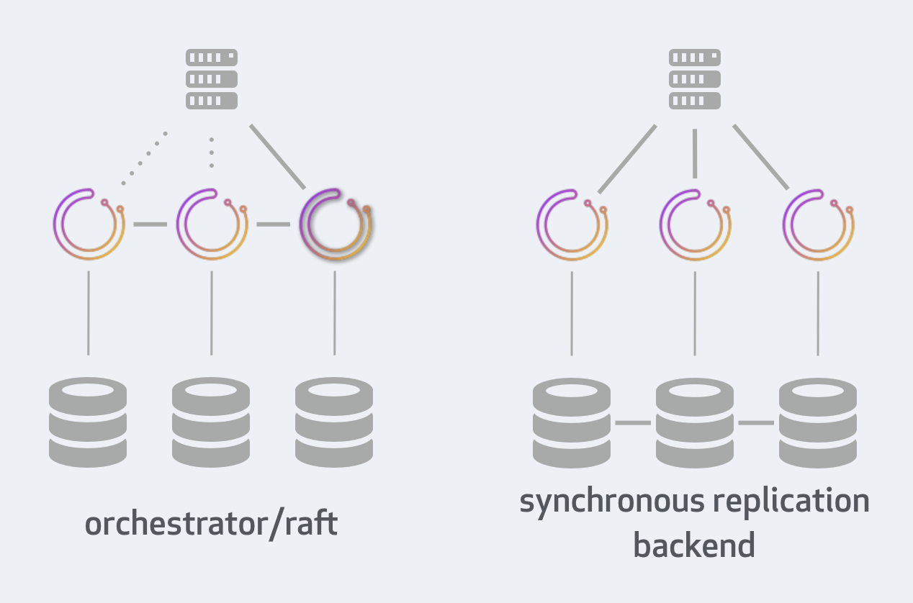

# orchestrator/raft vs. synchronous replication setup

This compares deployment, behavioral, limitations and benefits of two high availability deployment approaches: `orchestrator/raft` vs `orchestrator/[galera|xtradb cluster|innodb cluster]`

