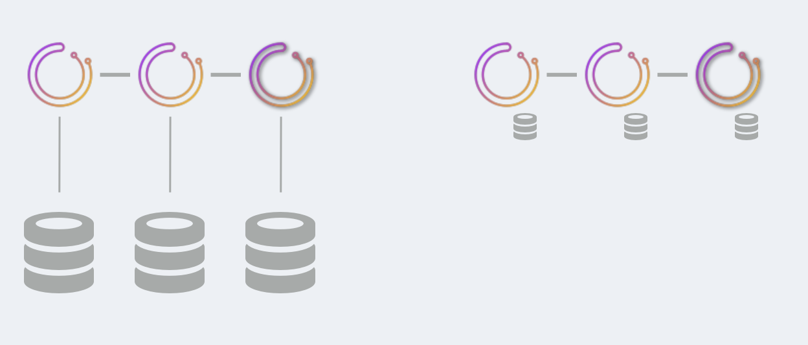
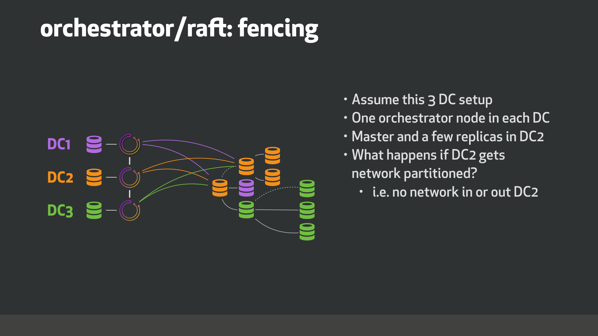
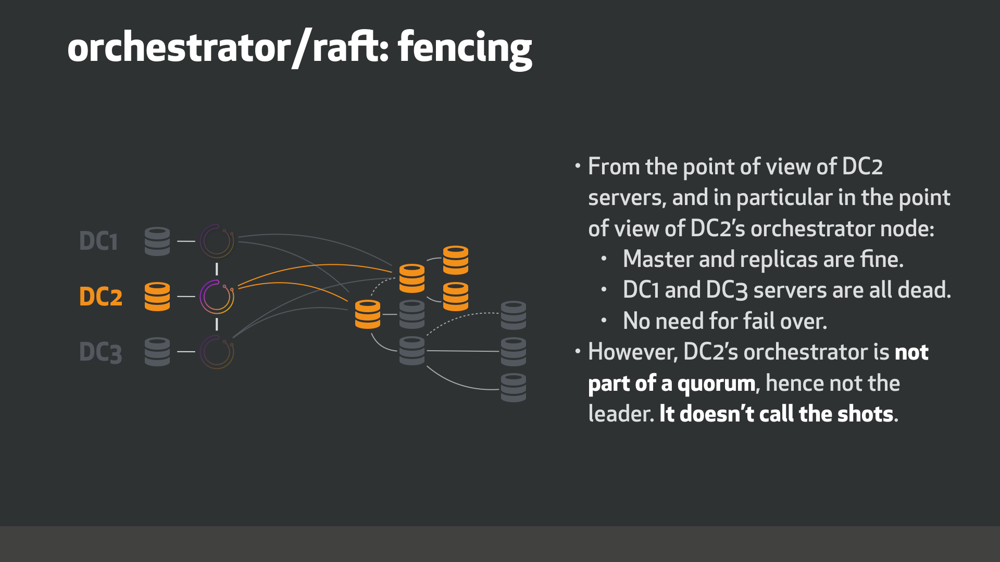
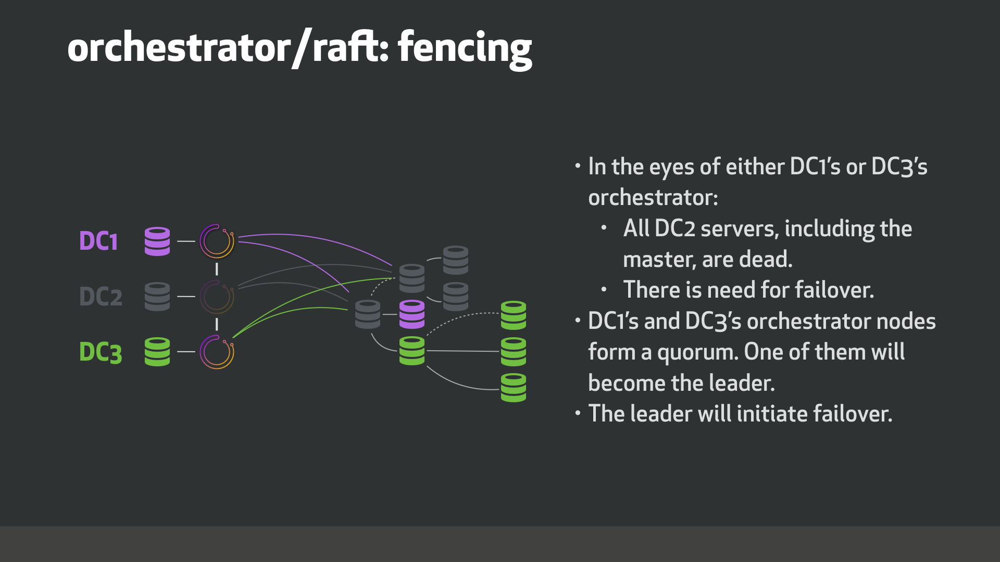
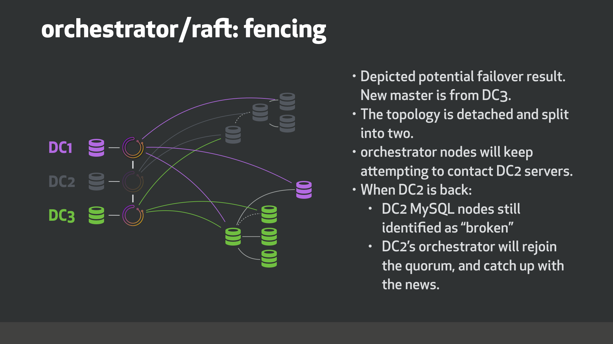

# Orchestrator/raft, consensus cluster



`orchestrator/raft` is a deployment setup where several `orchestrator` nodes communicate with each other via `raft` consensus protocol.

`orchestrator/raft` deployments solve both high-availability for `orchestrator` itself as well as solve issues with network isolation, and in particular cross-data-center network partitioning/fencing.

### Very brief overview of traits of raft

By using a consensus protocol the `orchestrator` nodes are able to pick a leader that has _quorum_, implying it is not isolated. For example, consider a `3` node `orchestrator/raft` setup. Normally the three nodes will chat with each other and one will be a stable elected leader. However in face of network partitioning, say node `n1` is partitioned away from nodes `n2` and `n3`, it is guaranteed that the leader will be either `n2` or `n3`. `n1` would not be able to lead because it does not have a quorum (in a `3` node setup the quorum size is `2`; in a `5` node setup the quorum size is `3`)

This turns useful in cross data-center (DC) setups. Assume you set three `orchestrator` nodes, each on its own DC. If one DC gets isolated, it is guaranteed the active `orchestrator` node will be one that has consensus, i.e. operates from outside the isolated DC.

### orchestrator/raft setup technical details

See also: [orchestrator/raft vs. synchronous replication setup](raft-vs-sync-repl.md)

#### Service nodes

You will set up `3` or `5` (recommended raft node count) `orchestrator` nodes. Other numbers are also legitimate but you will want at least `3`.

At this time `orchestrator` nodes to not join dynamically into the cluster. The list of nodes is preconfigured as in:

```json
  "RaftEnabled": true,
  "RaftDataDir": "/var/lib/orchestrator",
  "RaftBind": "<ip.or.fqdn.of.this.orchestrator.node>",
  "DefaultRaftPort": 10008,
  "RaftNodes": [
    "<ip.or.fqdn.of.orchestrator.node1>",
    "<ip.or.fqdn.of.orchestrator.node2>",
    "<ip.or.fqdn.of.orchestrator.node3>"
  ],
```

#### Backend DB

Each `orchestrator` node has its own, dedicated backend database server. This would be either:

- A MySQL backend DB (no replication setup required, but OK if this server has replicas)

  As deployment suggestion, this MySQL server can run on the same `orchestrator` node host.

- A SQLite backend DB. Use:
```json
  "BackendDB": "sqlite",
  "SQLite3DataFile": "/var/lib/orchestrator/orchestrator.db",
```

`orchestrator` is bundled with `sqlite`, there is no need to install an external dependency.

#### Proxy: leader

Only the leader is allowed to make changes.

Simplest setup it to only route traffic to the leader, by setting up a `HTTP` proxy (e.g HAProxy) on top of the `orchestrator` services.

> See [orchestrator-client](#orchestrator-client) section for an alternate approach

- Use `/api/leader-check` as health check. At any given time at most one `orchestrator` node will reply with `HTTP 200/OK` to this check; the others will respond with `HTTP 404/Not found`.
  - Hint: you may use, for example, `/api/leader-check/503` is you explicitly wish to get a `503` response code, or similarly any other code.
- Only direct traffic to the node that passes this test

As example, this would be a `HAProxy` setup:

```
listen orchestrator
  bind  0.0.0.0:80 process 1
  bind  0.0.0.0:80 process 2
  bind  0.0.0.0:80 process 3
  bind  0.0.0.0:80 process 4
  mode tcp
  option httpchk GET /api/leader-check
  maxconn 20000
  balance first
  retries 1
  timeout connect 1000
  timeout check 300
  timeout server 30s
  timeout client 30s

  default-server port 3000 fall 1 inter 1000 rise 1 downinter 1000 on-marked-down shutdown-sessions weight 10

  server orchestrator-node-0 orchestrator-node-0.fqdn.com:3000 check
  server orchestrator-node-1 orchestrator-node-1.fqdn.com:3000 check
  server orchestrator-node-2 orchestrator-node-2.fqdn.com:3000 check
```

#### Proxy: healthy raft nodes

A relaxation of the above constraint.

Healthy raft nodes will reverse proxy your requests to the leader. You may choose (and this happens to be desirable for `kubernetes` setups) to talk to any healthy raft member.

You _must not access unhealthy raft members, i.e. nodes that are isolated from the quorum_.

- Use `/api/raft-health` to identify that a node is part of a healthy raft group.
- A `HTTP 200/OK` response identifies the node as part of the healthy group, and you may direct traffic to the node.
- A `HTTP 500/Internal Server Error` indicates the node is not part of a healthy group.
  Note that immediately following startup, and until a leader is elected, you may expect some time where all nodes report as unhealthy.
  Note that upon leader re-election you may observe a brief period where all nodes report as unhealthy.

#### orchestrator-client

An alternative to the proxy approach is to use `orchestrator-client`.

[orchestrator-client](orchestrator-client.md) is a wrapper script that accesses the `orchestrator` service via HTTP API, and provides a command line interface to the user.

It is possible to provide `orchestrator-client` with the full listing of all orchestrator API endpoints. In such case, `orchestrator-client` will figure out which of the endpoints is the leader, and direct requests at that endpoint.

As example, we can set:

```shell
export ORCHESTRATOR_API="https://orchestrator.host1:3000/api https://orchestrator.host2:3000/api https://orchestrator.host3:3000/api"
```

A call to `orchestrator-client` will first check

Otherwise, if you already have a proxy, it's also possible for `orchestrator-client` to work with the proxy, e.g.:

```shell
export ORCHESTRATOR_API="https://orchestrator.proxy:80/api"
```

### Behavior and implications of orchestrator/raft setup

- In the `raft` setup, each `orchestrator` node independently runs discoveries of all servers. This means that in a three node setup, each of your `MySQL` topology servers will be independently visited by three different `orchestrator` nodes.

- In normal times, the three nodes will see a more-or-less identical picture of the topologies. But they will each have their own independent analysis.

- Each `orchestrator` nodes writes to its own dedicated backend DB server (whether `MySQL` or `sqlite`)

- The `orchestrator` nodes communication is minimal. They do not share discovery info (since they each discover independently). Instead, the _leader_ shares with the other nodes what user instructions is intercepted, such as:

  - `begin-downtime`
  - `register-candidate`

    etc.

  The _leader_ will also educate its followers about ongoing failovers.

  The communication between `orchestrator` node does not correlate to transactional database commits, and is sparse.

- All user changes must go through the leader, and in particular via the `HTTP API`. You must not manipulate the backend database directly, since such a change will not be published to the other nodes.

- As result, on a `orchestrator/raft`, one may not use the `orchestrator` executable in command line mode: an attempt to run `orchestrator` cli will refuse to run when `raft` mode is enabled. Work is ongoing to allow some commands to run via cli.

- A utility script, [orchestrator-client](orchestrator-client.md) is available that provides similar interface as the command line `orchestrator`, and that uses & manipulates `HTTP API` calls.

- You will only install the `orchestrator` binaries on `orchestrator` service nodes, and no where else. The `orchestrator-client` script can be installed wherever you wish to.

- A failure of a single `orchestrator` node will not affect `orchestrator`'s availability. On a `3` node setup at most one server may fail. On a `5` node setup `2` nodes may fail.

- An `orchestrator` node cannot run without its backend DB. With `sqlite` backend this is trivial since `sqlite` runs embedded with `orchestrator`. With `MySQL` backend, the `orchestrator` service will bail out if unable to connect to the backend DB over a period of time.

- An `orchestrator` node may be down, then come back. It will rejoin the `raft` group, and receive whatever events it missed while out. It does not matter how long the node has been away. If it does not have relevant local `raft` log/snapshots, another node will automatically feed it with a recent snapshot.

- The `orchestrator` service will bail out if it can't join the `raft` group.

See also [Master discovery with Key Value stores](kv.md#kv-and-orchestratorraft) via `orchestrator/raft`.

### Main advantages of orchestrator/raft

- Highly available
- Consensus: failovers are made by leader node that is member of quorum (not isolated)
- Supports `SQLite` (embedded) backend, no need for `MySQL` backend though supported.
- Little cross-node communication ; fit for high latency cross DC networks

### DC fencing example

Consider this example of three data centers, `DC1`, `DC2` and `DC3`. We run `orchestrator/raft` with three nodes, one in each data center.



What happens when `DC2` gets network isolated?







### Roadmap

Still ongoing and TODO:

- Failure detection to require quorum agreement (i.e. a `DeadMaster` needs to be analyzed by multiple `orchestrator` nodes) in order to kick failover/recovery.

- Support sharing of probing (mutually exclusive to the above): the `leader` will divide the list of servers to probe between all nodes. Potentially by data-center. This will reduce probing load (each MySQL server will be probed by a single node rather than all nodes). All `orchestrator` nodes will see same picture as opposed to independent views.
